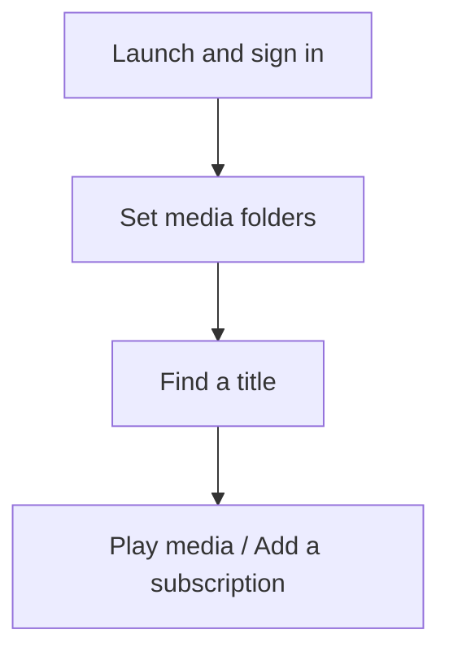

[中文](README.md) | [English](README.en.md) | [日本語](README.ja.md)

# AnimeMachine

AnimeMachine is an anime library manager with Chinese, English, and Japanese interfaces. It combines title metadata, media files, and subscription progress, with support for search, seasonal subscriptions, collection management, series relationships, and playback. It runs on Windows, Linux, macOS, and Docker.

## Features

- **Seasonal subscriptions**: view premiere dates and episode progress in Release radar, search seasonal resources, and select a release group for an Ani-RSS subscription.
- **Collection management**: identify existing media, compare Torrent releases with local files, and create plans to fill gaps. Organize folders by work and series.
- **Title search**: filter by year, format, studio, theme, or collection status, and search by Chinese, English, or Japanese names.
- **Series relationships**: view prequels, sequels, movies, and side stories in the relationship graph.
- **Playback and subtitles**: select a starting episode, send a season playlist to VLC, PotPlayer, or another player, and manage external subtitles.
- **Service connections**: connect existing qBittorrent, Ani-RSS, or NAS media folders. The interface supports Chinese, English, Japanese, and light or dark themes.

## Quick start

Select a launch method for your device. Detailed steps are in the [setup and usage guide](docs/guide.en.md#start).

| Platform | Launch method |
| --- | --- |
| Windows 10 / 11 | Download the Windows ZIP from [Releases](https://github.com/kyupi-git/animemachine/releases/latest), extract it, and double-click `AnimeMachine.cmd`. Python is included. |
| Linux | Install Python 3.11 or later, download and extract the matching Linux release, then run `./AnimeMachine-Linux.sh`. |
| macOS | Install Python 3.11 or later, download and extract the matching macOS release, then open `AnimeMachine-macOS.command`. |
| NAS / Docker | Choose a [Compose setup](docs/guide.en.md#docker). Save its `compose.yaml` and run `docker compose up -d`. |

After launch, open **<http://localhost:8787>**. From another device, replace `localhost` with the address of the computer or NAS running AnimeMachine. Your initial account and randomly generated password appear in the launch window or container logs.

AnimeMachine downloads the catalog automatically and fills in covers in the background. Once the library page opens, you can browse titles and set up your media folders.

## Documentation

| Topic | Document |
| --- | --- |
| Installation, sign-in, and initial setup | [Setup and usage guide](docs/guide.en.md#start) |
| Follow new anime, fill gaps, explore relationships, or play media | [Everyday use](docs/guide.en.md#daily-use) |
| Connect a downloader, Ani-RSS, or an existing media library | [Connections and folders](docs/guide.en.md#connections) |
| Update, back up, or solve a problem | [Updates and backups](docs/guide.en.md#maintenance) · [Common questions](docs/guide.en.md#help) |
| Understand the components and folder layout | [Architecture](docs/architecture.en.md) |
| Look up environment variables, network options, or development tools | [Configuration and technical reference](docs/reference.en.md) |

[Changelog](CHANGELOG.en.md) · [Contributing](CONTRIBUTING.md)

AnimeMachine is licensed under [AGPL-3.0-only](LICENSE). Title metadata comes from [Bangumi Archive](https://github.com/bangumi/Archive); subscriptions connect through [Ani-RSS](https://github.com/wushuo894/ani-rss). See [THIRD-PARTY.md](THIRD-PARTY.md) for component and data credits.
