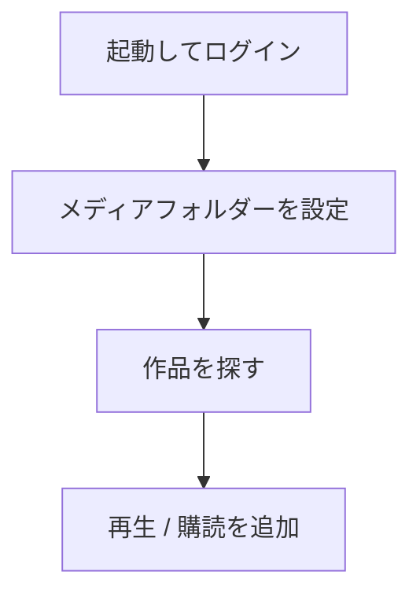

[中文](README.md) | [English](README.en.md) | [日本語](README.ja.md)

# AnimeMachine

AnimeMachine は、中国語・英語・日本語の UI に対応したアニメライブラリ管理ツールです。作品情報、メディアファイル、購読の進捗を統合し、作品検索、新作の購読、コレクション管理、シリーズの関係確認、再生機能を提供します。Windows、Linux、macOS、Docker で利用できます。

## 主な機能

- **新作の購読**：新作レーダーで放送開始日と話数を確認し、シーズンのリソースを検索します。リリースグループを選んで Ani-RSS に購読を追加できます。
- **コレクション管理**：既存メディアと Torrent の内容を照合し、不足分の取得計画を作成します。フォルダーは作品やシリーズごとに整理します。
- **作品検索**：年代、形式、制作会社、テーマ、所蔵状況で絞り込み、中国語・英語・日本語の作品名で検索できます。
- **シリーズの関係確認**：作品関係図で前作、続編、劇場版、番外編を確認できます。
- **再生と字幕**：開始する話を選び、シーズンのプレイリストを VLC、PotPlayer などに渡します。外部字幕も管理できます。
- **サービス接続**：既存の qBittorrent、Ani-RSS、NAS のメディアフォルダーを接続できます。中国語・英語・日本語の表示と、ライト・ダークテーマに対応しています。

## クイックスタート

お使いの機器に合わせて起動方法を選んでください。詳しい手順は[導入・利用ガイド](docs/guide.ja.md#start)にあります。

| 利用する環境 | 起動方法 |
| --- | --- |
| Windows 10 / 11 | [Releases](https://github.com/kyupi-git/animemachine/releases/latest) から Windows 用 ZIP をダウンロードし、展開して `AnimeMachine.cmd` をダブルクリックします。Python は同梱されています。 |
| Linux | Python 3.11 以降をインストールし、対応する Linux 用パッケージを展開して `./AnimeMachine-Linux.sh` を実行します。 |
| macOS | Python 3.11 以降をインストールし、対応する macOS 用パッケージを展開して `AnimeMachine-macOS.command` を開きます。 |
| NAS / Docker | [Compose 構成](docs/guide.ja.md#docker)を選び、`compose.yaml` を保存して `docker compose up -d` を実行します。 |

起動後は **<http://localhost:8787>** を開きます。別の機器から使う場合は、`localhost` を AnimeMachine が動いているパソコンや NAS のアドレスに置き換えてください。初回のアカウントと自動生成されたパスワードは、起動ウィンドウまたはコンテナのログに表示されます。

作品データは自動で取り込まれ、カバーはバックグラウンドで順次追加されます。作品一覧が開いたら、作品を探したり、メディアフォルダーを設定したりできます。

## ドキュメント

| 内容 | 参照先 |
| --- | --- |
| 導入、ログイン、初期設定 | [導入・利用ガイド](docs/guide.ja.md#start) |
| 新作を追う、不足分を補う、関係図を見る、再生する | [日常の使い方](docs/guide.ja.md#daily-use) |
| ダウンローダー、Ani-RSS、既存のメディアを接続する | [接続とフォルダー](docs/guide.ja.md#connections) |
| 更新、バックアップ、問題の解決 | [更新とバックアップ](docs/guide.ja.md#maintenance) · [よくある質問](docs/guide.ja.md#help) |
| コンポーネントとフォルダー構成を知る | [アーキテクチャ](docs/architecture.ja.md) |
| 環境変数、ネットワーク設定、開発ツールを調べる | [設定・技術リファレンス](docs/reference.ja.md) |

[更新履歴](CHANGELOG.ja.md) · [開発への参加](CONTRIBUTING.md)

AnimeMachine のライセンスは [AGPL-3.0-only](LICENSE) です。作品データは [Bangumi Archive](https://github.com/bangumi/Archive)、購読機能の連携先は [Ani-RSS](https://github.com/wushuo894/ani-rss) です。各コンポーネントとデータの出典は [THIRD-PARTY.md](THIRD-PARTY.md) に記載しています。
