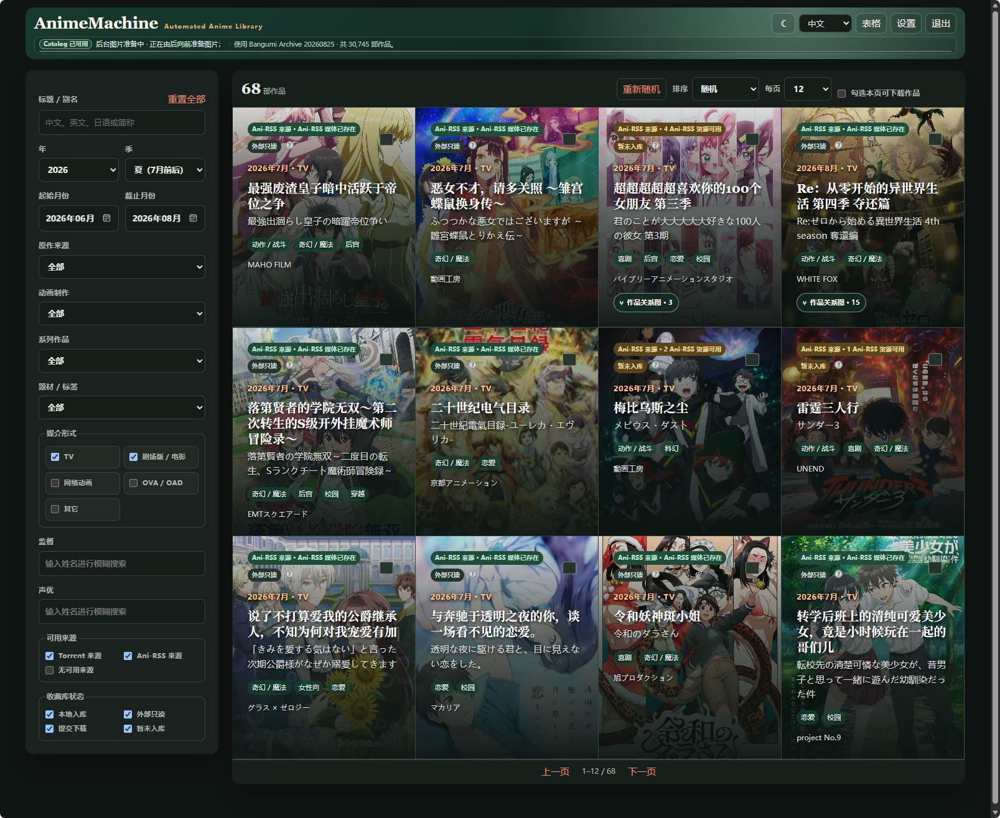
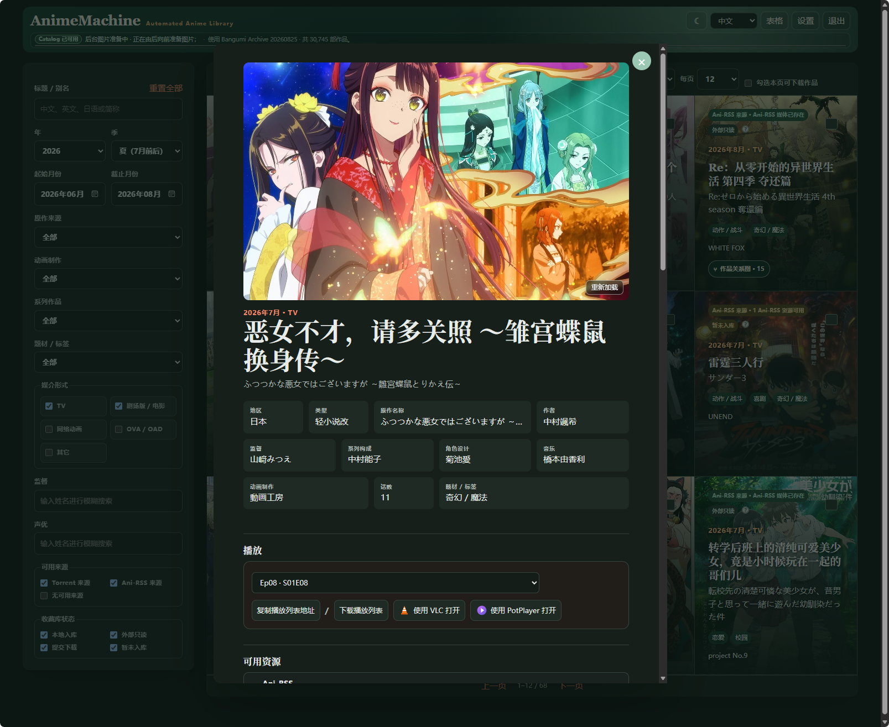
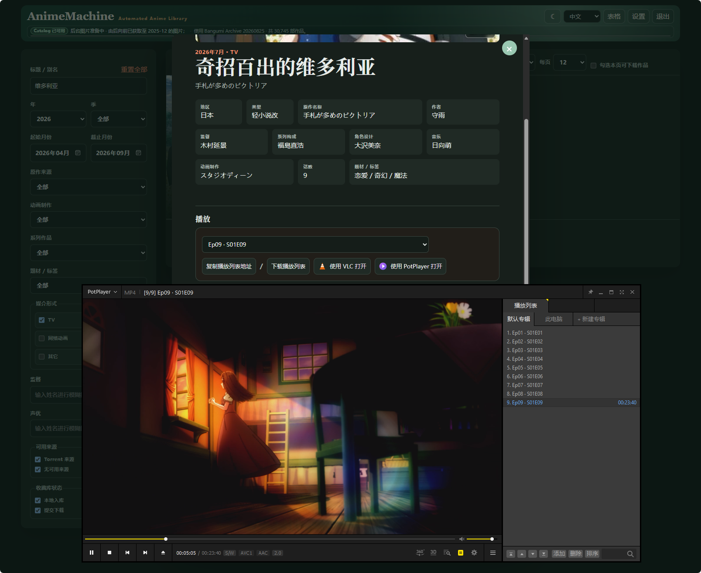
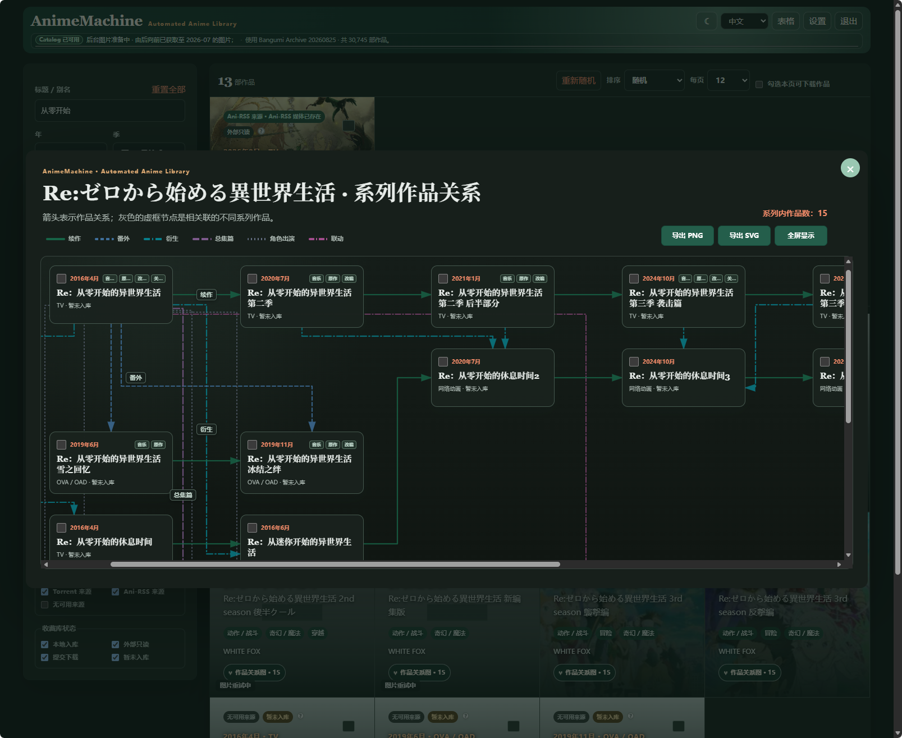

[中文](README.md) | [English](README.en.md) | [日本語](README.ja.md)  
[README](README.md) | [部署与使用指南](docs/guide.md) | [架构与数据库](docs/architecture.md) | [更新日志](CHANGELOG.md)

# AnimeMachine · Automated Anime Library

AnimeMachine 是一款全自动动画收藏库系统，负责把动画元数据、Torrent 池、媒体目录和外部只读媒体库整理到同一套本地 Catalog 与状态体系。**AnimeMachine 本身不提供动画检索或下载**，也不内置 Torrent、磁力链接或媒体内容，由用户设置本地动画收藏库的路径或挂载外部只读库，映射自己的 Torrent Pool 或使用 Torrent Collector 从公共索引收集符合规则的合集类 `.torrent` 元数据，并自行连接 qBittorrent、Ani-RSS 等组件完成实际下载或订阅。随着动画新作的持续播出，用户收藏的持续增长，AnimeMachine 的工作重点体现在对资源来源、目录命名、媒体文件、作品信息、系列关系、既有收藏等内容的一致性维护，能实现超大量级的动画收藏库的持续性管理。

如果把一部动画从“发现资源”到“进入收藏库”的过程拆开，AnimeMachine 主要连续完成七项工作：(1)原材料筛选：扫描 Torrent 池，先判断是不是完整资源，再比较合集形式、资源组、片源、分辨率等条件；(2)投料：把用户确认的任务交给 qBittorrent，或者把连载订阅交给 Ani-RSS；(3)初加工：根据首播年月、正式标题和系列归属规划多级目录；(4)精加工：建立前作、续作、总集篇、番外、衍生、不同演绎、跨系列关联和角色出演等逻辑关系；(5)质检：把 Torrent manifest 与本地文件逐项比较，只补缺失内容，并且只有存在可靠修订证据时才暂存和替换旧文件；(6)包装：通过中、英、日三语 Web 页面统一浏览动画目录、资源候选、收藏状态和系列关系；(7)贮存：把已经下载、外部映射和等待下载的作品，组织成一套可以继续扩展和维护的动画仓库。



*收藏库首页：默认展示最近播出的动画，支持多种方式筛选和排序。*



*作品详情页：展示一部动画的主要信息，均读取自 Bangumi Archive。*



*AnimeMachine 的播放器交接：在检测到可用媒体资源后，AnimeMachine 采用一种“生成 m3u 播放列表并交接”的独特方式，推送全集地址至本地播放器，可以实现全集自动跳转播放，并可从中间集数开始播放。该方式兼容多种平台、多种设备，只要安装了 VLC / PotPlayer 等支持 m3u 播放列表的本地播放器。甚至，即便 AnimeMachine 未挂载 Ani-RSS 媒体目录，只要通过 API key 连接 Ani-RSS，仍然可以通过 AnimeMachine HTTP 中继生成 m3u 播放列表并播放，并支持 Range 拖动和短暂断线续传。同时，也支持直接控制 Ani-RSS 订阅新作。*



*作品关系图：这是 AnimeMachine 根据数据库记录的作品间的逻辑关系，自动生成的可视化图形。由于逻辑关系是多对多，甚至存在多层嵌套，关系图的绘制是极其复杂的，要优化作品节点的摆放坐标，要避免多条关系线潜在的轨道碰撞，还要鉴别原始关系数据的错误和缺失，利用旁证推导正确的关系网，最后算法的运行时间要可接受。*

## 主要能力

- 基于 Bangumi Archive 的动画底库。首次启动会在后台构建本地 SQLite Catalog，完整性检查通过后再原子发布。
- Torrent 池采用增量扫描。已经处理且指纹未变化的文件不会重复解析；即使大型 Torrent 池仍在全量扫描，已经完成的批次也可以先用于查询和资源选择。
- Docker 自动收藏方案支持启用 Torrent Collector。Collector 结合标题、Torrent manifest 和本地 Catalog 证据执行 `accept / reject / defer` 三态判断：只有 `accept` 写入共享 Torrent 池，证据不足时保持 `defer`，而不是用固定集数跨度猜测完整。每周更新的单集资源可以向 Ani-RSS 发起订阅请求并远程访问。
- 下载规划支持完整合集、单集/单卷拼接、差分补完，以及同一 infohash 追加文件选择。AnimeMachine 管理的 qBittorrent 任务会先生成计划，并始终以停止状态提交；确认内容后再由用户在 qBittorrent 中启动。
- 收藏库既可以是本地媒体目录，也可以是可读写 UNC/NAS 目录；已有媒体还可以作为外部只读媒体库映射进来，不要求搬迁或重新命名。
- qBittorrent、Ani-RSS 和 Torrent Collector 都是可选组件。可以只使用其中一部分，也可以在 Compose 中组成完整自动收藏链路。
- 播放功能生成 M3U 播放列表，再交给系统播放器、VLC 或 PotPlayer；服务器路径与客户端路径不一致时，可以单独配置播放器可访问的映射。
- 对归档类资源，程序可以检查内嵌/外挂字幕，并连接用户自行配置的字幕服务；外部只读媒体不会因为字幕处理被改写。
- 支持生成作品关系图，呈现动画在所属系列的位置，系列中各作品的逻辑关系。在作品关系图中，可以点击跳转其它关联作品。

## 快速开始

### 本地运行

Windows 用户运行 `scripts/windows/AnimeMachine.cmd`；Linux 用户运行 `scripts/unix/AnimeMachine-Linux.sh`；macOS 用户运行 `scripts/unix/AnimeMachine-macOS.command`。从源码首次启动时，需要预先安装 Python 3.11 或更高版本；启动脚本会建立隔离环境并安装当前项目。

详细步骤见 [部署与使用指南](docs/guide.md#本地部署)。Release 同时保留 Windows、Linux 和 macOS 三套启动入口，但只有构建平台的运行时或依赖会随包直接提供；换到其它系统运行时，需要预装 Python 3.11 或更高版本，首次启动也可能联网补充当前平台的兼容依赖。

### Docker Compose

`deploy/compose` 提供四种预设方案：(1)AnimeMachine 独立运行；(2)连接外部 qBittorrent；(3)启用 Torrent Collector 和内置 qBittorrent；(4)把 Torrent Collector、qBittorrent 与 Ani-RSS 一并纳入同一 Compose 项目。前三种方案均可按需连接外部 Ani-RSS，未配置时不影响动画底库、目录、Torrent Pool 与本地收藏管理。

0.2.0 的预设方案默认固定公开镜像 `ghcr.io/kyupi-git/animemachine:0.2.0`。如自行改为 `latest`，Compose 会跟随后续发布；生产环境建议继续固定具体版本标签。

进入对应目录后，将 `.env.example` 复制为 `.env`，填写宿主机路径和所需密钥，再运行 `docker compose up -d`。四种方案按组件边界区分；具体选择主要取决于现有 qBittorrent、Ani-RSS 和媒体目录是否已经在其它位置运行。完整配置见 [部署与使用指南](docs/guide.md#docker-compose)。

## 文档

- [部署与使用指南](docs/guide.md)：本机、NAS、Compose、首次建库、下载、Ani-RSS、播放和日常维护。
- [架构与数据库](docs/architecture.md)：模块边界、数据流、目录规则、关系图算法、SQLite 实体和状态原则。
- [第三方与数据边界](THIRD-PARTY.md)；[安全策略](SECURITY.md)；[参与开发](CONTRIBUTING.md)。

## 构建与清理

Windows：

```text
scripts\windows\Build-Release.cmd
scripts\windows\Build-Docker-Image.cmd
scripts\windows\Clean-AnimeMachine.cmd
```

Linux/macOS：

```bash
./scripts/unix/build-release.sh
./scripts/unix/build-docker-image.sh
./scripts/unix/Clean-AnimeMachine.sh
```

所有构建产物统一写入 `dist`。清理脚本仅处理构建、测试和解释器缓存，并保留数据库、封面缓存、用户配置与收藏历史；其用途是清理开发产物，而非重置 AnimeMachine。

## 数据与许可

动画底库来自 [Bangumi Archive](https://github.com/bangumi/Archive)，Ani-RSS 的连接方式参考 [ani-rss](https://github.com/wushuo894/ani-rss)。第三方组件、数据来源和许可边界见 [THIRD-PARTY.md](THIRD-PARTY.md)。

AnimeMachine 以 AGPL-3.0-only 发布。
