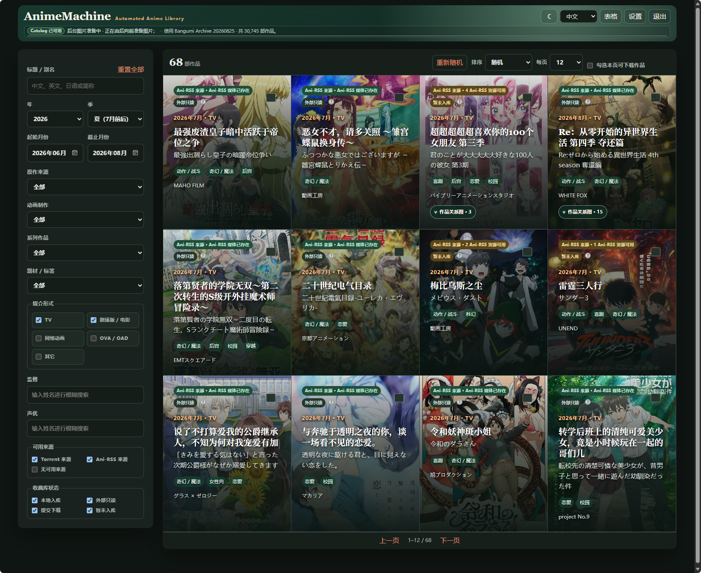
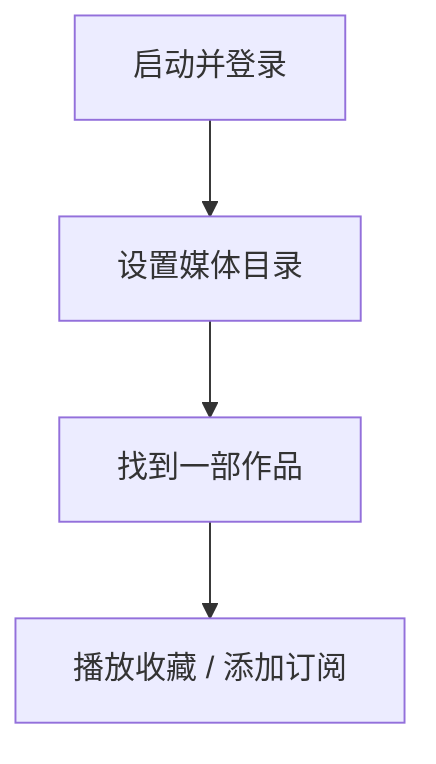

[中文](README.md) | [English](README.en.md) | [日本語](README.ja.md)

# AnimeMachine

AnimeMachine 是一款支持中、英、日三语界面的动画库管理工具。它整合作品资料、媒体文件与订阅进度，提供作品检索、新番追更、收藏整理、系列关系查询和播放功能，可在 Windows、Linux、macOS 或 Docker 中运行。

## 主要功能

- **新番追更**：通过新作雷达查看开播日期和最新话数，检索季度资源，选择字幕组并添加 Ani-RSS 订阅。
- **收藏管理**：识别已有媒体，比较 Torrent 资源与本地文件，生成补齐计划；按作品和系列组织目录。
- **作品检索**：按年代、类型、制作公司、主题和收藏状态筛选，支持中文、英文和日文名称搜索。
- **系列关系**：通过作品关系图查看前作、续作、剧场版和番外。
- **播放与字幕**：选择起始集，向 VLC、PotPlayer 等播放器提供整季播放列表，并管理外置字幕。
- **服务接入**：连接已有的 qBittorrent、Ani-RSS 或 NAS 媒体目录。界面支持中文、英文、日文及明暗主题。

## 快速开始

根据设备选择启动方式，具体步骤见[部署与使用指南](docs/guide.md#start)。

| 使用场景 | 启动方式 |
| --- | --- |
| Windows 10 / 11 | 从 [Releases](https://github.com/kyupi-git/animemachine/releases/latest) 下载 Windows ZIP，解压后双击 `AnimeMachine.cmd`。发布包包含 Python 运行环境。 |
| Linux | 安装 Python 3.11 或更新版本，下载对应的 Linux 发布包，解压后运行 `./AnimeMachine-Linux.sh`。 |
| macOS | 安装 Python 3.11 或更新版本，下载对应的 macOS 发布包，解压后打开 `AnimeMachine-macOS.command`。 |
| NAS / Docker | 选择 [Compose 方案](docs/guide.md#docker)，保存其 `compose.yaml`，执行 `docker compose up -d`。 |

启动后打开 **<http://localhost:8787>**。从其他设备访问时，将 `localhost` 替换为运行 AnimeMachine 的电脑或 NAS 地址。初始账户和随机密码显示在启动窗口或容器日志中。

首次启动会自动下载作品资料并建立作品库，封面在后台逐步补齐。作品列表加载完成后，即可浏览作品和配置媒体目录。

```mermaid
flowchart TB
    A[启动并登录] --> B[设置媒体目录]
    B --> C[找到一部作品]
    C --> D[播放收藏 / 添加订阅]
```

## 使用文档

| 内容 | 文档 |
| --- | --- |
| 安装、登录与首次设置 | [部署与使用指南](docs/guide.md#start) |
| 追新番、补收藏、看关系图和播放 | [日常使用](docs/guide.md#daily-use) |
| 接入下载器、Ani-RSS 或已有媒体库 | [连接与目录](docs/guide.md#connections) |
| 更新、备份或处理使用中的问题 | [更新与备份](docs/guide.md#maintenance) · [常见问题](docs/guide.md#help) |
| 了解组件和目录如何配合 | [架构说明](docs/architecture.md) |
| 查环境变量、网络参数和开发入口 | [配置与技术参考](docs/reference.md) |

[更新日志](CHANGELOG.md) · [参与开发](CONTRIBUTING.md)

AnimeMachine 使用 [AGPL-3.0-only](LICENSE) 许可证。作品资料来自 [Bangumi Archive](https://github.com/bangumi/Archive)，追番连接使用 [Ani-RSS](https://github.com/wushuo894/ani-rss)。组件和资料来源见 [THIRD-PARTY.md](THIRD-PARTY.md)。
