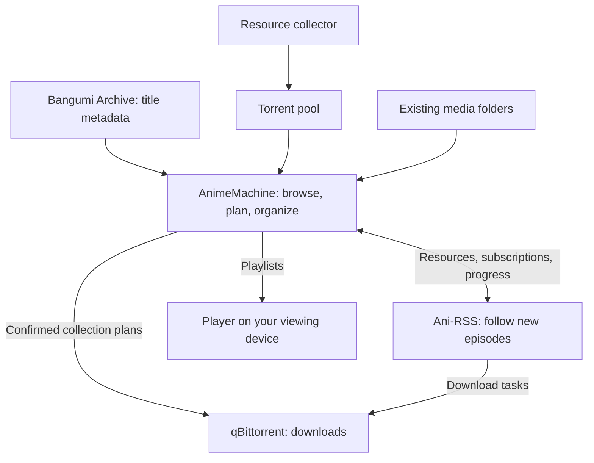

[中文](architecture.md) | [English](architecture.en.md) | [日本語](architecture.ja.md)  
[README](../README.en.md) · [Setup and usage guide](guide.en.md) · [Configuration and technical reference](reference.en.md)

# AnimeMachine architecture

AnimeMachine associates metadata, media files, resources, and subscriptions with individual works. Bangumi Archive supplies title data, media scans determine local collection status, and qBittorrent and Ani-RSS handle downloads and subscriptions. The interface provides title browsing, collection planning, and playback controls.

## Components and responsibilities



| Component | Responsibility |
| --- | --- |
| AnimeMachine | Browse titles, identify media, compare releases, plan folders, show progress, and create playlists |
| Bangumi Archive | Supply titles, dates, staff, cast, and relationships |
| qBittorrent | Run download tasks and save media files |
| Ani-RSS | Discover seasonal releases, manage subscriptions, and provide episode and media information |
| Torrent pool / resource collector | Store or gather `.torrent` files for collection plans |
| External player | Play files or network playlists from the selected episode |

The standalone setup lets you browse titles and connect existing media. Add a downloader, Ani-RSS, or the collector when needed, or connect services you already run.

## Title and file associations

An anime can have Chinese, English, Japanese, and other names. AnimeMachine groups them by Bangumi work ID. Subscriptions and media stay associated with that work when its metadata is imported or updated.

A collection may contain multiple seasons; a movie may belong to the same series as a TV show; extras may be stored in a supplementary folder. AnimeMachine identifies works and series, then associates resources, files, and destinations with them. These associations provide metadata and playback controls in title details.

Folders use the premiere month and original title, with seasons and extras grouped under a series. This is a layout example; actual names come from title metadata:

```text
Library/
├── 『YYYY_MM』『Original work title』/
└── 『YYYY_MM』『Original series title』/
    ├── 『YYYY_MM』『First season title』/
    ├── 『YYYY_MM』『Sequel title』/
    └── Series Extras/
```

Connect existing media as an external read-only library to keep its current layout. Ani-RSS media can be connected through a folder or its API. See [Connections and folders](guide.en.md#folders) for paths.

## Collection, subscriptions, and playback

**Collection** starts with the Torrent pool: identify a release, compare it with existing files, and prepare a download and folder plan. Once confirmed, the plan adds stopped tasks to qBittorrent. After you start the tasks and downloads finish, a media scan updates your collection status.

**Subscriptions** start in Release radar or Ani-RSS: search releases, choose a group, and add a subscription. Ani-RSS downloads new episodes; AnimeMachine syncs subscription and media progress into the library.

**Playback** starts with identified media: choose a source and starting episode, and AnimeMachine creates a season playlist. The player reads media through an accessible local path, share, or HTTP address.

Collection status comes from media checks. Available resources, download tasks, and subscription progress each have their own records. Title details bring them together so you can follow a release through to its files.

## Background tasks

- **Title data**: the first launch downloads and builds the catalog. Weekly Archive checks run on Thursday at 02:12, UTC+8. If there is no new archive, one follow-up runs 24 hours later, followed by the next weekly cycle.
- **Covers**: works you are browsing come first, followed by recent and older titles. You can use the library while images are loading.
- **Media and resources**: scheduled folder scans and service syncs update collection status, episodes, and subscriptions.
- **Ongoing tasks**: progress and recent valid results are saved. Unfinished work resumes after a restart; remote tasks retry when connectivity returns.

Background work runs separately from page interactions. Diagnostics summarizes network, storage, image, and service status; Logs shows recent significant results.

## Settings and data storage

| Content | Local release | Host folders for Docker |
| --- | --- | --- |
| User settings | `config.json`, `.env.local` | `config`, plus `.env` if present |
| Catalog, accounts, credentials, and runtime records | `data/state` | `data/state`; some service credentials are stored in `config` |
| Collected media | Your configured library folder | `library` or your chosen folder |
| Existing / Ani-RSS media | Your configured external folders | `external/read-only` / `external/ani-rss` or your chosen folders |
| Torrent pool | Your configured Torrent folder | `torrents` or your chosen folder |

The title catalog and runtime records are stored separately. The catalog holds metadata; runtime records hold scans, subscriptions, tasks, and history. Metadata updates merge new title information with existing records, retaining downloads and media associations.

New data is prepared and validated before the active catalog is updated. Moves, renames, and replacements have recoverable history records. See [Updates and backups](guide.en.md#maintenance) before updating or moving your installation.

## Related documentation

For everyday tasks, use the [setup and usage guide](guide.en.md). The [configuration and technical reference](reference.en.md) covers environment variables, network options, data files, and code entry points. Release changes are in the [changelog](../CHANGELOG.en.md).
