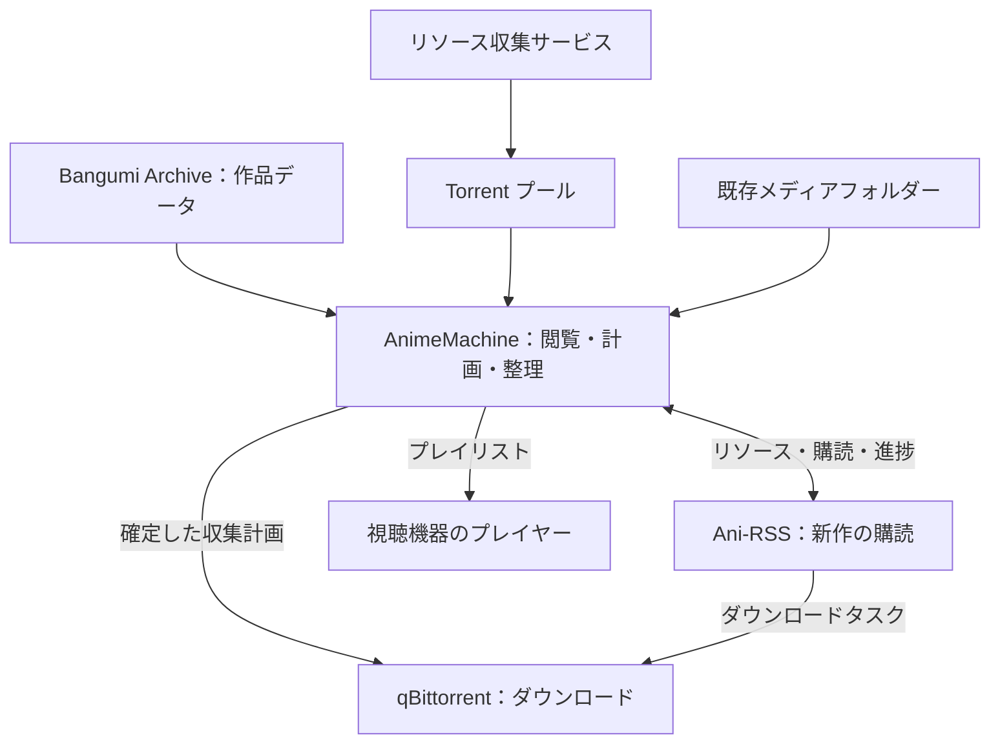

[中文](architecture.md) | [English](architecture.en.md) | [日本語](architecture.ja.md)  
[README](../README.ja.md) · [導入・利用ガイド](guide.ja.md) · [設定・技術リファレンス](reference.ja.md)

# AnimeMachine のアーキテクチャ

AnimeMachine は、作品ごとにメタデータ、メディアファイル、リソース、購読記録を関連付けます。Bangumi Archive が作品情報を提供し、メディアの走査で所蔵状況を確認します。qBittorrent と Ani-RSS がダウンロードと購読を処理し、共通の画面で作品の閲覧、収集計画、再生を利用できます。

## 各コンポーネントの役割



| コンポーネント | 日常の役割 |
| --- | --- |
| AnimeMachine | 作品の閲覧、メディアの識別、リリースの比較、保存先の計画、進捗表示、プレイリスト作成 |
| Bangumi Archive | 作品名、日付、スタッフ、キャスト、作品関係の提供 |
| qBittorrent | ダウンロードとメディアの保存 |
| Ani-RSS | 新作リリースの検索、購読管理、話数とメディア情報の提供 |
| Torrent プール / 収集サービス | 収集計画に使う `.torrent` ファイルの保存・収集 |
| 外部プレイヤー | 指定した話からファイルやネットワークのプレイリストを再生 |

単独構成で作品を探し、既存メディアを接続できます。ダウンローダー、Ani-RSS、収集サービスは必要に応じて追加でき、すでに使っているサービスも接続できます。

## 作品とファイルの対応

一つの作品には、中国語・英語・日本語など複数の名前があります。AnimeMachine は Bangumi の作品 ID でまとめます。データを取り込んだり更新したりしても、購読とメディアは同じ作品に対応します。

一括リリースには複数のシーズンが含まれる場合があり、テレビ版と劇場版は同じシリーズに属する場合があります。番外編は追加コンテンツのフォルダーに保存されることもあります。作品とシリーズを識別してリソース、ファイル、保存先を関連付け、作品詳細に情報と再生機能をまとめます。

フォルダーは初回放送年月と原題を使い、シリーズ内に各シーズンと追加コンテンツをまとめます。下記は構成例です。実際の名前は作品データから生成されます。

```text
Library/
├── 『YYYY_MM』『作品の原題』/
└── 『YYYY_MM』『シリーズの原題』/
    ├── 『YYYY_MM』『第1期の原題』/
    ├── 『YYYY_MM』『続編の原題』/
    └── Series Extras/
```

既存メディアを外部読み取り専用ライブラリとして接続すれば、現在の構成をそのまま使えます。Ani-RSS のメディアはフォルダーまたは API 経由で接続できます。パスは[接続とフォルダー](guide.ja.md#folders)を参照してください。

## 収集・購読・再生の流れ

**収集**は Torrent プールから始まります。リリースを識別し、既存ファイルと比べ、ダウンロードと保存先の計画を作ります。確定後、qBittorrent に停止中のタスクが追加されます。タスクを開始し、完了すると、メディアの走査で所蔵状況が更新されます。

**購読**は新作レーダーや Ani-RSS から始まります。リリースを検索し、グループを選んで購読を追加します。Ani-RSS が新しい話を取得し、AnimeMachine が購読とメディアの状態を一覧に反映します。

**再生**は識別済みメディアから始まります。再生元と開始する話を選ぶと、シーズンのプレイリストを作成します。プレイヤーは利用できるローカルパス、共有パス、HTTP アドレスからメディアを読み込みます。

所蔵状況は実際のメディアを確認して判定します。利用できるリソース、ダウンロードタスク、購読の進捗はそれぞれ記録され、作品詳細でまとめて確認できます。

## バックグラウンド処理

- **作品データ**：初回にダウンロードしてカタログを作成します。Archive は毎週木曜日 02:12（UTC+8、日本時間 03:12）に確認します。新版がない場合は24時間後にもう一度確認し、その後は次週の確認に移ります。
- **カバー**：閲覧中の作品から準備し、最近の作品、古い作品へ進みます。画像の準備中も一覧を使えます。
- **メディアとリソース**：設定した間隔でフォルダーを走査し、サービスと同期して所蔵、話数、購読を更新します。
- **継続タスク**：進捗と直近の有効な結果を保存します。再起動後は未完了の処理を続け、ネットワーク復旧後にリモート処理を再試行します。

バックグラウンド処理と画面操作は分けて実行します。「診断」でネットワーク、ストレージ、画像、各サービスの状態を、「ログ」で最近の重要な結果を確認できます。

## 設定とデータの保存先

| 内容 | ローカルのリリース | Docker のホスト側フォルダー |
| --- | --- | --- |
| ユーザー設定 | `config.json`、`.env.local` | `config`、`.env`（使用時） |
| カタログ、アカウント、キー、実行記録 | `data/state` | `data/state`。一部のサービス用キーは `config` |
| 収集したメディア | 設定したライブラリ | `library` または指定先 |
| 既存 / Ani-RSS のメディア | 設定した外部フォルダー | `external/read-only` / `external/ani-rss` または指定先 |
| Torrent プール | 設定した Torrent フォルダー | `torrents` または指定先 |

作品カタログと実行記録は分けて保存します。前者は作品情報、後者は走査、購読、タスク、履歴を記録します。データ更新では新しい作品情報を既存の記録と統合し、ダウンロードやメディアとの対応を維持します。

新しいデータを準備・検証してから、使用中のカタログを更新します。メディアの移動、改名、置換には復元可能な履歴があります。更新や移行前の手順は[更新とバックアップ](guide.ja.md#maintenance)を参照してください。

## 関連ページ

実際の操作は[導入・利用ガイド](guide.ja.md)にあります。環境変数、ネットワーク設定、データファイル、コードの入口は[設定・技術リファレンス](reference.ja.md)、バージョンごとの変更は[更新履歴](../CHANGELOG.ja.md)を参照してください。
