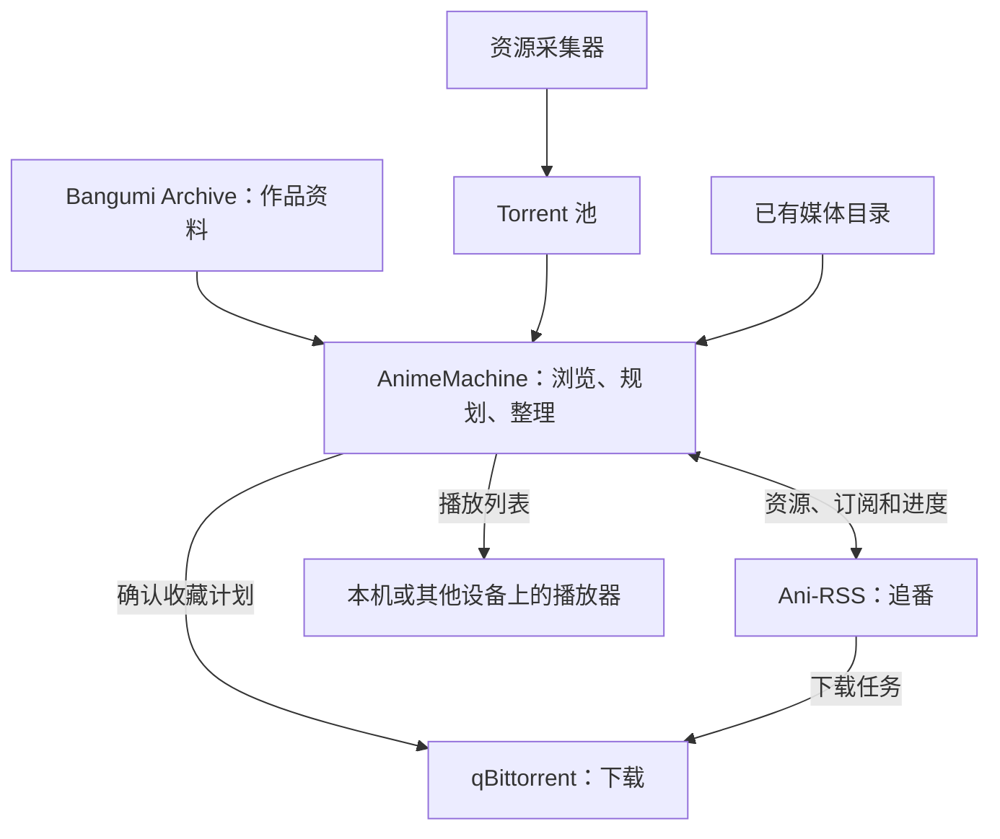

[中文](architecture.md) | [English](architecture.en.md) | [日本語](architecture.ja.md)  
[README](../README.md) · [部署与使用指南](guide.md) · [配置与技术参考](reference.md)

# AnimeMachine 架构说明

AnimeMachine 以作品为单位关联元数据、媒体文件、资源与订阅记录。Bangumi Archive 提供作品资料，媒体扫描确认本地收藏，qBittorrent 与 Ani-RSS 执行下载及追番任务；统一界面提供作品浏览、收藏规划和播放入口。

## 组件与职责



| 组件 | 职责 |
| --- | --- |
| AnimeMachine | 浏览作品、识别媒体、比较候选资源、规划目录、显示进度、生成播放列表 |
| Bangumi Archive | 提供作品名称、日期、制作人员、角色和作品关系 |
| qBittorrent | 执行下载任务，保存媒体文件 |
| Ani-RSS | 查询新番资源，管理追番订阅，提供集数和媒体信息 |
| Torrent 池 / 资源采集器 | 保存或补充 `.torrent` 文件，供收藏计划使用 |
| 外部播放器 | 按选择的起始集播放本地文件或网络播放列表 |

安装独立版即可浏览作品并接入已有媒体。下载器、Ani-RSS 和资源采集器可以按需要加入，也可以沿用已有服务。

## 作品与文件的对应关系

一部作品的名称可能有中文、英文、日文等多个版本。AnimeMachine 使用 Bangumi 作品 ID 汇总这些名称；导入和更新资料时，订阅与已有文件继续对应同一部作品。

合集可能包含多个季度，剧场版与电视版可能属于同一系列，番外也可能位于附加内容目录。程序先识别作品和系列，再关联资源、文件及目标目录，详情页据此提供作品资料与媒体播放入口。

目录按首播年月和原名组织，系列下再放各季与附加内容。下面是结构示意，具体名称由作品资料生成：

```text
Library/
├── 『YYYY_MM』『作品原名』/
└── 『YYYY_MM』『系列原名』/
    ├── 『YYYY_MM』『第一季原名』/
    ├── 『YYYY_MM』『续作原名』/
    └── Series Extras/
```

已有媒体可以作为外部只读库接入，继续使用原来的目录。Ani-RSS 的媒体也可以通过目录或 API 接入。路径填写方法见[连接与目录](guide.md#folders)。

## 收藏、追番和播放的流程

**收藏**从 Torrent 池开始：识别资源，比较本地文件，生成下载与目录计划。用户确认后，qBittorrent 收到停止的任务；开始下载并完成后，媒体扫描更新收藏状态。

**追番**从新作雷达或 Ani-RSS 开始：检索资源，选择发布组，添加订阅。Ani-RSS 下载新集，AnimeMachine 同步订阅和媒体进度，作品列表随之更新。

**播放**从已识别的媒体开始：用户选择来源和起始集，AnimeMachine 生成整季播放列表。播放器使用可访问的本地路径、共享路径或 HTTP 地址读取媒体。

收藏状态由实际媒体核验；资源可用、下载任务、订阅进度分别保存自己的记录。详情页将这些信息放到同一部作品下，方便查看从资源到文件的进展。

## 后台任务

- **作品资料**：首次启动下载并建库，之后按周检查 Archive。自动检查时间为每周四 02:12（UTC+8）；本次没有新版时，24 小时后补查一次，再进入下周周期。
- **封面**：先准备正在浏览的作品，再补近期和更早的作品。列表可以在图片准备期间使用。
- **媒体与资源**：按配置的间隔扫描目录和同步服务，更新收藏、集数和订阅状态。
- **连续任务**：保存进度和最近有效结果，重启后继续处理未完成的工作。网络恢复后，远程任务继续重试。

后台工作与页面操作分开运行。诊断页集中显示网络、存储、图片和服务状态；日志页用于查看近期的重要结果。

## 设置与数据存储

| 内容 | 本地发布包 | Docker 中的宿主机目录 |
| --- | --- | --- |
| 用户设置 | `config.json`、`.env.local` | `config`、`.env`（如有） |
| 作品库、账户、凭据和运行记录 | `data/state` | `data/state`，部分服务凭据保存在 `config` |
| 收藏媒体 | 设置的收藏库目录 | `library` 或自定义目录 |
| 原有媒体 / Ani-RSS 媒体 | 配置的外部目录 | `external/read-only` / `external/ani-rss` 或自定义目录 |
| Torrent 池 | 配置的种子目录 | `torrents` 或自定义目录 |

作品库与运行记录分开保存：前者记录作品资料，后者记录扫描、订阅、任务和历史。资料更新时，会将新的作品信息与现有记录合并；下载和媒体记录继续保留。

程序会先准备并验证新资料，再更新正在使用的作品库。媒体移动、改名和替换使用可恢复的历史记录。更新或迁移前的备份步骤见[更新与备份](guide.md#maintenance)。

## 相关文档

操作步骤见[部署与使用指南](guide.md)。环境变量、网络设置、数据文件与代码入口见[配置与技术参考](reference.md)；版本变化见[更新日志](../CHANGELOG.md)。
