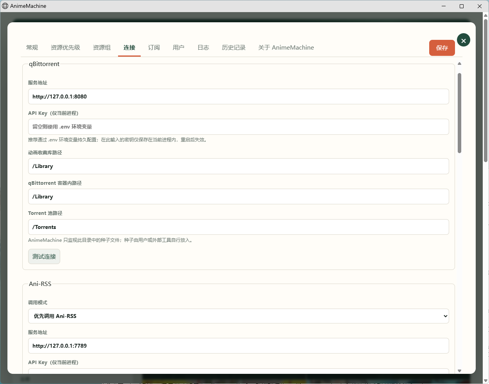
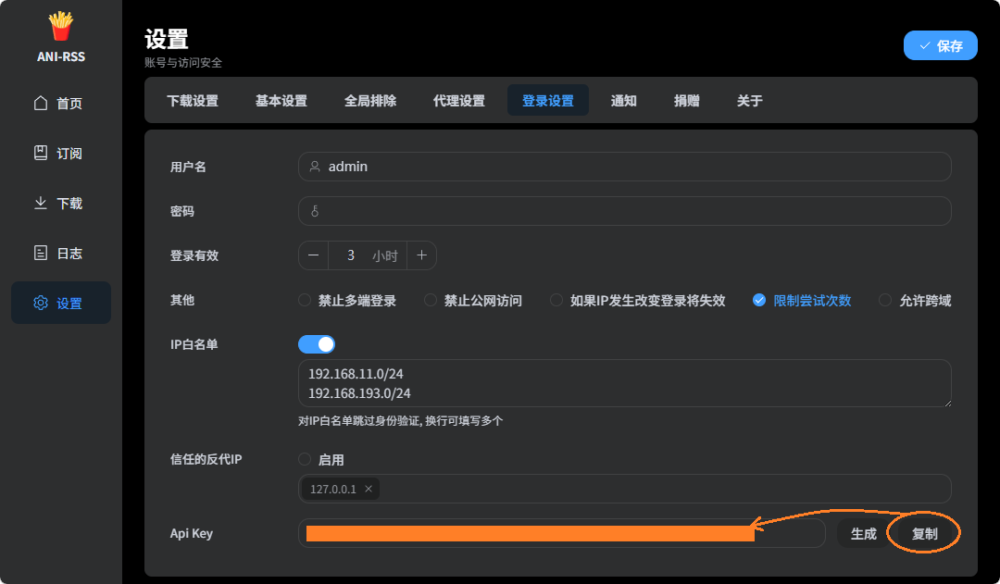
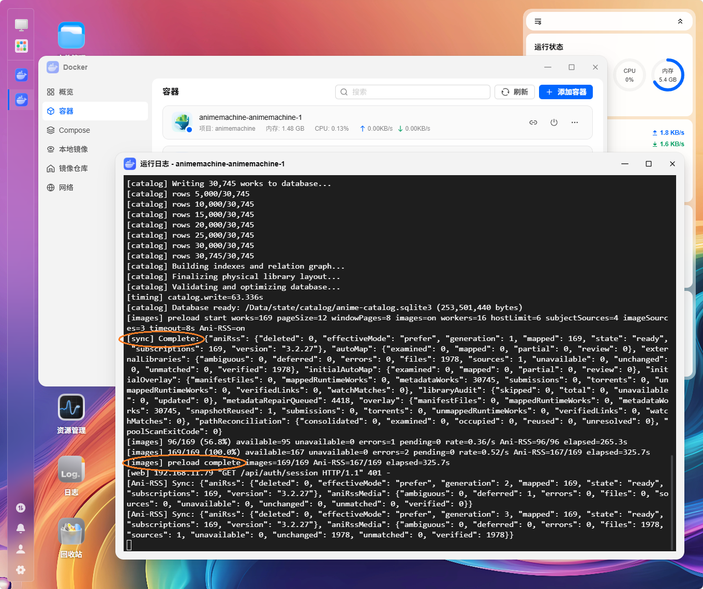

[中文](guide.md) | [English](guide.en.md) | [日本語](guide.ja.md)  
[README](../README.en.md) | [Deployment and Usage Guide](guide.en.md) | [Architecture and Database](architecture.en.md)

# AnimeMachine Deployment Guide

An AnimeMachine deployment begins with two decisions: (1) where media managed by AnimeMachine will be stored; and (2) whether existing qBittorrent, Ani-RSS, Torrent pools, and older media libraries will remain external or be managed together under Compose. Most other settings follow from these choices.

Before the first run, only an anime library needs to be prepared. The Torrent pool and external read-only library may initially be empty, and neither qBittorrent nor Ani-RSS is a prerequisite for starting AnimeMachine. They can be connected later without rebuilding the Catalog.

## Path meanings

| Name | Access | Purpose | Recommended setting |
|---|---|---|---|
| Anime library | Read/write | Stores media, placeholders, subtitles, and directory structure managed by AnimeMachine | Local disk, NAS share, or container `/Library` |
| Torrent pool | AnimeMachine read-only | Directory containing `.torrent` files supplied by the user or optional Torrent Collector; subdirectories and unrelated files are allowed | Separate directory or container `/Torrents` |
| External read-only media library | Read-only | Maps existing media without moving, renaming, or deleting it | ani-rss or another media directory; container `/External` |
| Ani-RSS media directory | Read-only | Maps media downloaded by Ani-RSS into work pages and playlists | Container `/Media` |
| State directory | Read/write | Stores SQLite databases, Archive data, covers, subtitles, plans, and operation history | Local SSD; container `/Data` |
| Configuration directory | Read/write | Stores `config.json`, certificates, and component configuration | Container `/Config` |

The most common source of confusion is the difference among a “host path,” the path “seen by AnimeMachine,” and the path “seen by qBittorrent.” With local execution these are often identical; with Docker or cross-host deployment they may be completely different. AnimeMachine only requires the final mapping to be real and accessible. Different processes do not need to use the same path string.

Windows local deployment can use drive-letter paths or UNC paths directly, for example `D:\Anime` or `\\nas\anime`. The Windows account running AnimeMachine is the account that accesses a UNC share, so that account must have direct read/write permission. A mapped drive belongs to the current logon session and should not be the only dependency of a long-running background service. Confirm permissions by using the same account to create, rename, and delete a test file on the share.

Inside Docker, `/Library`, `/Torrents`, and similar paths are fixed container paths; users only map real host directories to them. External qBittorrent additionally needs the path to the library as qBittorrent itself sees it. That value may be `/Anime`, `/downloads/anime`, or a UNC path and does not need to match AnimeMachine's `/Library`. Windows Docker Desktop is generally a poor place to use a UNC path directly as a bind source; it is more reliable to mount SMB/NFS through the host OS first and pass the resulting local mount point to Docker. The same model is recommended on Linux, macOS, and fnOS.



*Settings → Connections: verify the managed library, Torrent Pool, external media library, qBittorrent, and Ani-RSS paths and connection state in one place.*

The API key required for an Ani-RSS connection is available under “Login settings” in the Ani-RSS interface.



## Local deployment

### Windows 10/11

A Windows local installation is best done in this order: (1) source mode requires Python 3.11 or later; the official Windows Release bundles the fixed Python 3.14 runtime and does not require a separate Python installation, while root-level `BUILD-INFO.json` records the version, commit, and build environment; (2) in source mode run `scripts\windows\AnimeMachine.cmd`, while an extracted Release uses `AnimeMachine.cmd` in the package root; (3) the first startup creates the local environment file and initial administrator credentials, and the console shows the initial login information together with its storage location; the credential file remains available, but later startups do not keep generating new passwords; (4) open `http://127.0.0.1:8877`, go to “Settings → Connections,” and configure the anime library, Torrent pool, and any external components that should be connected; (5) source-mode state defaults to `.local/state`, while Release state defaults to `data/state`, and subsequent launches reuse the existing Catalog, caches, and history.

If paths should be prepared before the first startup, copy `deploy/local/.env.local.example` to `.local/.env.local` and uncomment only the required entries. A Release uses `.env.local` in its root directory. Avoid storing NAS usernames and passwords in AnimeMachine merely to save a setup step; for Windows local execution, it is preferable for the process account itself to have access to the share.

### Linux/macOS

In source mode, Linux runs `scripts/unix/AnimeMachine-Linux.sh` and macOS runs `scripts/unix/AnimeMachine-macOS.command`. The first launch creates an isolated environment under `.local/venv`, and Python 3.11 or later is required. An extracted Release uses the corresponding launcher in the package root. Every Release retains Windows, Linux, and macOS entry points, but when it is run on a platform different from the build platform, the system must provide Python 3.11+ and the first launch may retrieve compatible dependencies for that platform.

If the extraction tool did not preserve Unix executable bits, first run `chmod +x AnimeMachine.sh AnimeMachine-Linux.sh AnimeMachine-macOS.command`. For NAS access on macOS, mount SMB in Finder and use a path such as `/Volumes/share/...`. On Linux, it is preferable to mount SMB/NFS through the operating system under `/mnt` or `/srv`. This keeps AnimeMachine working with ordinary filesystem paths while authentication, reconnection, and network-filesystem behavior remain the operating system's responsibility.

## Docker Compose

Docker deployment requires Docker Engine 24+ and Docker Compose 2.20.3+. If AnimeMachine directly manages qBittorrent, the target qBittorrent version must be 5.2.0 or later. Enter the selected layout directory, copy `.env.example` to `.env`, and at minimum verify the paths, AnimeMachine administrator password, and external-service secrets. When bundled qBittorrent or Ani-RSS is used, the repository's `Initialize-AnimeMachine` script can generate the required AnimeMachine, qBittorrent, and Ani-RSS credentials and display them together once.

After configuration, run:

```bash
docker compose up -d
docker compose logs -f animemachine
```

Keeping `.env` beside `compose.yaml` is normally the most reliable arrangement. If an automation platform must place the environment file elsewhere and Compose is started with `--env-file`, set `ANM_ENV_FILE` to the absolute path of that same file. Otherwise Compose and the service container may read different configurations, causing variable values and service behavior to diverge.

On fnOS, for example, the first Compose startup downloads the Bangumi Archive base package. Wait for `[sync] Complete`, which means the Catalog is ready for access while cover preloading may continue. `[images] preload complete` means covers for the most recent six months have finished preloading.



### Four deployment layouts

| Directory | Components | Torrent Pool source | Recommended use |
|---|---|---|---|
| `01-animemachine-standalone` | AnimeMachine; optional external Ani-RSS | User-maintained directory or empty | Maintains the catalog, directories, external media, and Torrent Pool independently; works without Ani-RSS |
| `02-animemachine-external-qbt` | AnimeMachine + external qBittorrent; optional external Ani-RSS | User-maintained directory | Manual library; matches Torrent Pool resources and submits them to external qBittorrent |
| `03-animemachine-managed-qbt` | AnimeMachine + Torrent Collector + bundled qBittorrent; optional external Ani-RSS | Resources gathered by Collector | Automated library; Collector gathers resources and bundled qBittorrent maintains the library |
| `04-full-stack` | AnimeMachine + Torrent Collector + bundled qBittorrent + bundled Ani-RSS | Collections gathered by Collector | Fully automated collection and subscription; all components are managed by one Compose project |

The four layouts are independent rather than a low-to-high feature hierarchy. Ani-RSS is optional in the first three layouts. A machine that already has stable qBittorrent will often fit layout 02; choose 03 or 04 when AnimeMachine and the download chain are being moved together to a NAS or dedicated host.

Layouts 03 and 04 include the shared service definition in `deploy/compose/torrent-collector.yaml`; Release packages place that file alongside the layout's `compose.yaml`. Torrent Collector runs the `torrent-collector` command from the AnimeMachine image and has write access to the host Torrent Pool, while AnimeMachine still mounts `/Torrents` read-only. Collector uses title, Torrent-manifest, and local-Catalog evidence to produce `accept / reject / defer`, and only `accept` enters the Torrent Pool. When the evidence is insufficient, the result stays undecided instead of being guessed complete from a fixed episode span. Existing-pool audit is report-only by default; quarantining clearly rejected files must be enabled explicitly, and the quarantine directory must be outside the Torrent Pool. Ongoing single-episode or single-volume tracking is still better delegated to Ani-RSS.

The ordinary `.env` contains only settings that commonly need to change. Proxy behavior, polling intervals, historical backfill batches, retry limits, audit mode, and a separate Collector state directory are documented in `deploy/compose/torrent-collector.advanced.env.example`. Copy only the required advanced entries into `.env`; proxying is disabled by default.

### fnOS / NAS

On fnOS or a similar NAS, it is useful to prepare six classes of directories in the Docker project area: `config`, `data`, `imports`, `torrents`, `library`, and `external`. Allocate them according to I/O behavior: (1) keep `config` and `data` on SSD storage; (2) place `library` on the large-capacity media pool; (3) map `torrents` to the existing Torrent Pool and keep the AnimeMachine side read-only; (4) map `external` to ani-rss or older media directories, again read-only; (5) use real absolute NAS paths in `.env`, such as `/vol1/1000/docker/animemachine/data`; and (6) ensure the container `PUID/PGID` has write access to `config`, `data`, and `library`.

If the Web interface opens after deployment but files cannot be scanned, or media can be read but directories cannot be created, check the host mount and `PUID/PGID` before changing AnimeMachine's internal paths. Container paths are only the result of the mapping; host-side permissions are the more common root cause.

### Separating deployment from storage

AnimeMachine can run on a small host or virtual machine while media resides on another NAS. The recommended complete path is: NAS provides SMB/NFS → the AnimeMachine host mounts it → Compose receives only the local mount point. AnimeMachine then does not need to retain NAS credentials, and network-filesystem reconnection remains the responsibility of mature OS components.

Keep databases, Archive data, and cover caches on the host SSD when possible, while placing large media files and the Torrent Pool on network storage. The reason is straightforward: catalog construction, filtering, and relationship graphs repeatedly touch many small records, whereas video files are what actually require capacity. Separating these I/O patterns is usually more stable than putting the entire state directory on a NAS.

## Network and base package

AnimeMachine's network layer selects among official sources, user-configured mirrors, and direct connections, and validates Archive size and SHA-256. Proxy settings are read dynamically for each request, so enabling or disabling the system/environment proxy while the service is running can affect subsequent requests without a restart. Loopback and private networks remain direct so access to local qBittorrent, Ani-RSS, or NAS services does not take an unnecessary proxy route.

To prepare the base package manually, place the official `dump-*.zip` under `/Imports`, or under the `imports` directory for a local Release, then start AnimeMachine and import it. If a corporate HTTPS gateway uses a private CA, place the PEM CA in the configuration directory and set `ANM_CA_BUNDLE`. A certificate-verification failure means the trust chain is incomplete; the correct fix is to provide the CA, not to disable TLS verification.

## Updates and backups

Updates and backups can be reduced to four rules: (1) after updating source, run the launcher again so the isolated environment is reinstalled against the current project; (2) update Docker with `docker compose pull && docker compose up -d`; (3) backing up the state and configuration directories preserves databases, covers, subtitles, plans, and settings, while media files continue to follow the user's normal storage backup policy; and (4) never allow two AnimeMachine instances to write to the same state directory at the same time.

For a machine migration, copy the complete state and configuration directories first, then restore the original media paths or equivalent mappings. Copying only SQLite files may still produce a runnable system, but can lose caches, plans, or historical context and is therefore not the recommended migration method.

## Usage guide

### Initial catalog construction

On the first use, it is better not to enable every automation feature at once. A safer sequence is: (1) after login, open “Settings → Connections” and confirm access to the anime library, Torrent Pool, and any external media libraries; (2) under “General,” check and update the anime base package. Archive import runs in background stages, the top-right status reports the real stage and progress, and the complete Catalog is published only after validation; (3) the Torrent Pool is scanned incrementally on the configured interval. Completed batches can be queried immediately, and a work that does not yet show resources can be searched individually from its detail page; (4) if a large older media library already exists, run local-resource verification before enabling automated downloading.

Local verification has two levels. Fast mode mainly compares canonical targets, file distribution, and exact byte sizes and is intended for routine scans. Hash verification is used when a comparison baseline exists and the user explicitly enables exact verification. This raises evidence strength only where needed and avoids repeatedly calculating SHA-256 for every video.

### Selection and downloading

On first use, the home-page month filter covers the current month and the five preceding months. For example, in August 2026 the default range is 2026-03 through 2026-08. Later filter changes are stored in browser-local state. The default page size is 12 works. The theme follows the operating system by default and can also be switched manually between dark and light beside the language selector.

Automatic and manual resource selection can be mixed: (1) after works are selected, the system searches under the current policy for a plan with suitable completeness and priority; (2) when intervention is needed, a specific collection, combined-volume, multi-episode, or single-episode plan can be chosen from the work detail page. Automatic selection does not mean immediate downloading; it only produces a candidate under the current evidence.

When “Start download” is clicked, AnimeMachine first creates an immutable download plan. The plan lists the target directory, estimated space, files to add/skip/stage for replacement, and whether the job will be handed to qBittorrent or Ani-RSS. qBittorrent submissions remain stopped by default and start immediately only when the user explicitly enables automatic start.

The resource policy prefers complete collections and only then considers episode- or volume-level combinations. A combined plan must be judged from its actual coverage, and release groups that have stopped updating for a long period are reduced in priority. Existing local files are handled by a differential plan: a file with the same canonical target and exact byte size is skipped by default; missing items are filled only where needed; an older file with reliable revision evidence is staged first; and existing files that are not duplicates remain in place.

### Ani-RSS

After Ani-RSS is connected, three modes are available: (1) prefer: hand the work to Ani-RSS when no complete local collection is available; (2) fallback: call Ani-RSS only when there is no usable local plan at all; and (3) manual: access Ani-RSS only when the user clicks “Query Ani-RSS resources.” A temporary remote failure does not rewrite the user's selected long-term mode; when the connection returns, the original setting remains in effect.

Media managed by Ani-RSS is always treated as an external read-only source inside AnimeMachine and is not directly moved or renamed. By default, AnimeMachine synchronizes Ani-RSS subscription state and scans the configured Ani-RSS media directory every 30 minutes. Newly completed episodes of an ongoing series enter the playable set during later synchronization. If one work has multiple Ani-RSS subscriptions, they are retained separately by remote ID and do not overwrite one another.

The work detail page can delete an Ani-RSS subscription that already has downloaded content, but this is an explicit remote write operation: the UI asks for confirmation, AnimeMachine requests deletion of the subscription and files through the Ani-RSS HTTP API, and the remote list is synchronized again to verify the result. “External read-only” means AnimeMachine does not directly mutate the mapped media directory; it does not prohibit a user-confirmed Ani-RSS API deletion operation.

### Playback

In the library list, select a specific media item before using “Copy,” “Download playlist,” “Open with VLC,” or “Open with PotPlayer.” The generated M3U contains main-program media only and is ordered by episode. If several media copies represent the same episode, the default playlist chooses one and skips byte-identical copies; extras and the remaining copies stay visible in the library inventory. If playback starts from episode N, earlier items remain in the playlist; only the player start position changes to the selected item.


With local execution, a player can usually use filesystem paths directly. With Docker or remote deployment, this may not be true. The container path `/Library` has no meaning on the user's computer, so “Settings → External player handoff” must provide either an HTTP address reachable by the client or a mapping from server paths to client paths. For example, server `/Library` can map to Windows `\\nas\anime` or macOS `/Volumes/anime`. Directly invoking a local player only makes sense when the playback device can actually access the resulting path.

### Subtitles

For ongoing releases, candidate selection prefers subtitles in the user's language. Archival resources are checked in this order: (1) embedded subtitles; (2) same-name external subtitles; (3) local subtitle archives; and (4) user-configured subtitle services. When a new subtitle file is selected, the old subtitle is first backed up into the state directory. If the media comes from an external read-only library, the new subtitle is also stored under AnimeMachine state rather than written back to the original media path.

Subtitle handling and media ownership are therefore separate concerns: AnimeMachine can associate a subtitle with a read-only video for playback without acquiring permission to modify the external media library itself.

### Directories and history

A standalone work directory uses `『YYYY_MM』『Original Title』` by default. A series directory uses `『Start－End』『「Series Root」シリーズ』`, while child works inside the series continue to use their own first-air months. Split broadcasts belonging to the same official cour are merged under the first cour; mini-anime, Picture Drama, and similar material with a clear parent work are handled as attachments rather than receiving separate placeholder directories.

Directory handling begins by confirming work identity and the existing path. Before AnimeMachine moves, renames, or replaces a user-owned file, it records the change under “Settings → History”; ordinary directories created by AnimeMachine itself are not redundantly logged. If directory ownership, collection boundaries, or work identity still contain a conflict that cannot be proved automatically, the download plan remains in review until sufficient evidence is available.
