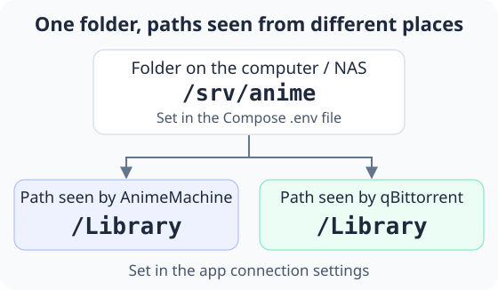

[中文](guide.md) | [English](guide.en.md) | [日本語](guide.ja.md)  
[README](../README.en.md) · [Architecture](architecture.en.md) · [Configuration reference](reference.en.md)

# Setup and usage guide

This guide covers deployment, initial setup, everyday use, and maintenance. Select a launch method for your device, sign in, and configure media folders and service connections as needed.

[Launch methods](#start) · [Initial setup](#first-use) · [Everyday use](#daily-use) · [Connections and folders](#connections) · [Updates and backups](#maintenance) · [Common questions](#help)

<a id="start"></a>

## 1. Choose a launch method

### Windows

1. Open [Releases](https://github.com/kyupi-git/animemachine/releases/latest). Under Assets, download the file ending in `release-windows.zip`.
2. Extract the entire ZIP to a permanent folder, such as `D:\AnimeMachine`.
3. Double-click **`AnimeMachine.cmd`** in that folder and leave the launch window open.
4. Open **<http://localhost:8787>** in your browser.

Python is included in the release. Use the same launcher next time; close its window to stop AnimeMachine.

### Linux / macOS

Install [Python 3.11 or later](https://www.python.org/downloads/), then download the release matching your operating system and processor from [Releases](https://github.com/kyupi-git/animemachine/releases/latest). `x86_64` generally means Intel / AMD; `arm64` or `aarch64` means ARM. Choose ARM for Apple silicon.

On Linux, extract the package, open a terminal in its folder, and run:

```sh
./AnimeMachine-Linux.sh
```

On macOS, open **`AnimeMachine-macOS.command`**, or run it from a terminal in the extracted folder:

```sh
./AnimeMachine-macOS.command
```

The launcher installs the required components. Open **<http://localhost:8787>**. Close the terminal or press `Ctrl+C` to stop the app. If you get an execution-permission error, run `chmod +x AnimeMachine*.sh AnimeMachine-macOS.command` first.

<a id="docker"></a>

### NAS / Docker

Enable Docker or container management in your NAS app center, or install [Docker](https://docs.docker.com/get-started/get-docker/) on your computer. Use Docker Engine 24+ and Docker Compose **2.20.3+**.

Select a configuration based on your existing services:

| Deployment scenario | Configuration |
| --- | --- |
| Browse titles and connect existing media | [01 · AnimeMachine](https://github.com/kyupi-git/animemachine/blob/main/deploy/compose/01-animemachine-standalone/compose.yaml) |
| You already run qBittorrent | [02 · Connect an existing downloader](https://github.com/kyupi-git/animemachine/blob/main/deploy/compose/02-animemachine-external-qbt/compose.yaml) |
| Install qBittorrent alongside AnimeMachine | [03 · AnimeMachine + qBittorrent](https://github.com/kyupi-git/animemachine/blob/main/deploy/compose/03-animemachine-managed-qbt/compose.yaml) |
| Install a downloader, Ani-RSS, and a resource collector together | [04 · Full stack](https://github.com/kyupi-git/animemachine/blob/main/deploy/compose/04-full-stack/compose.yaml) |

1. Create a permanent folder, such as `animemachine`.
2. Open a configuration above, click **Download raw file**, and save it in that folder as **`compose.yaml`**.
3. Open a terminal in the folder and run the command below. In a NAS Compose project manager, you can also paste the configuration and start the project.

```sh
docker compose up -d
```

4. Open **`http://YOUR-NAS-ADDRESS:8787`**, or **<http://localhost:8787>** on the same computer.
5. View the `animemachine` container logs for your initial account and password. From a terminal, run:

```sh
docker compose logs animemachine
```

Default folders and service connections are created automatically. Setups 03 and 04 configure qBittorrent; setup 04 also connects Ani-RSS. For setup 02, enter your existing downloader's details under [Connections](#connections).

To store media on a particular drive, add a `.env` file before starting, as shown in [Folder paths](#folders). To open qBittorrent or Ani-RSS from another computer, configure [access to their web interfaces](reference.en.md#service-access).

<a id="first-use"></a>

## 2. Initial setup

### Sign in and check the library

The launch window or container logs show your address, initial username, and random password. After signing in, follow the initialization progress: downloading title data, building the catalog, and preparing covers. You can use the library as soon as titles appear; covers continue loading in the background.

Create accounts for other people under **Settings → Users**. You can also create your own administrator account, sign in with it, and disable the initial account.

### Configure and check media folders

Configure media folders under **Settings → Connections**:

| Purpose | Setting |
| --- | --- |
| Organize new downloads | “Anime library path” under qBittorrent |
| Browse anime already on a drive | Enable “Map an external read-only library” and enter the media folder |
| Connect media downloaded by Ani-RSS | Enter its media path under Ani-RSS, or use remote playback through its API |

In Docker, enter the paths visible inside the container. The default collection is `/Library`; existing media uses `/External`. See the [folder diagram](#folders) for an example.

Save the configuration, open a title's details, and check that identified media can be played. For seasonal subscriptions, add one subscription using the next section and check the synchronization result. After verifying playback or a subscription, add further titles.


<a id="daily-use"></a>

## 3. Everyday use

### Browse and filter

Switch between cards and a table on the home page. Filter by year, month, format, studio, theme, resource source, or collection status. Search accepts Chinese, Traditional Chinese, English, and Japanese names.

A card's resource and subscription labels describe available releases or subscriptions. Its collection label describes your media holdings. Open details to see individual episodes and files. Use “New Episode Follow-up” to follow updates or “Random” to pick something to watch.

### Release radar and subscriptions

[Connect Ani-RSS](#ani-rss), then:

1. Open **Release radar** and choose the previous, current, or next season. Each season appears on one page.
2. Click **Sync** to refresh subscriptions, media, and releases for the selected season. **Search** checks the current season in sequence and shows progress immediately. If a title fails, the scan continues; click again to retry unfinished titles.
3. Click **Subscribe** for a title, choose a release or group, and confirm.
4. Ani-RSS handles downloading. You can close the window and keep browsing during submission. Subscription status and media progress sync back automatically; releases excluded by download settings show the reason.

The latest count in “Latest / total episodes” prioritizes Ani-RSS resource and subscription records. “Episode updated” appears when a timestamp is available. Click a column such as “Premiere date” to sort the entire season; click again to reverse the order.

New subscriptions move to the front of the home page in “New Episode Follow-up” and “Random” views. Your year, month, and other filters still apply.

### Fill gaps and download

Put existing `.torrent` files in your **Torrent pool** folder. The full Compose stack includes a resource collector that adds files there in the background. Its options are in the [collector configuration example](https://github.com/kyupi-git/animemachine/blob/main/deploy/compose/torrent-collector.advanced.env.example).

1. Find a title and check candidate releases and existing files in its details.
2. Select the works to collect, generate a plan, and review the files and destination folders.
3. Confirm the plan. Tasks are added to qBittorrent in a **stopped state**.
4. Open qBittorrent and start those tasks. AnimeMachine updates your collection status after downloads finish.

Plans compare releases with existing files and select content to fill gaps. Adjust your preferences under **Settings → Resource priority / Release groups**.

After a single-episode or single-volume task finishes, **Settings → Subscriptions** can track later releases. New matches appear for your confirmation.

### Create subscription folders and verify your library

After connecting a writable library and saving the settings, click **Folders** in Release radar to create placeholder folders for subscribed titles. Existing folders are reused; repeating the operation skips folders already created.

The same action is available under **Settings → General → Library**, alongside **Verify all local resources**. Both run in the background and show progress and results. Completeness is assessed against the files currently present.

### Relationship graph

Click **Relationship graph** on a card or in details to explore prequels, sequels, movies, and side stories. Drag, zoom, use fullscreen, filter relationship types, or export an image.


### Playback and subtitles

Open title details, choose a media source and starting episode, then select VLC, PotPlayer, or your system player. IINA is also available on macOS. Use **Copy playlist** to open the whole season in another player.


Install the player on the device you watch from. For playback on another device, set an AnimeMachine address that device can reach under **Settings → Connections → External player handoff**, such as `http://nas.example:8787`. If the player can access your media share directly, add an SMB / NFS path mapping.

Use embedded subtitles, subtitles alongside your media, or import subtitle files and archives in title details. For online search, enter your ASSRT or OpenSubtitles credentials under **Settings → Connections → Subtitle sources**, then search and select a match.

<a id="connections"></a>

## 4. Connections and folders

<a id="ani-rss"></a>

### Connect an existing Ani-RSS instance

Find the API Key under **Settings → Security** in Ani-RSS. Copy it into **Settings → Connections → Ani-RSS** in AnimeMachine:

| Setting | What to enter |
| --- | --- |
| Service address | An Ani-RSS address reachable from AnimeMachine, such as `http://localhost:7789` for a local installation |
| API Key | The key copied from Ani-RSS |
| Mode | “Prefer Ani-RSS” is the usual choice |
| Media path | The Ani-RSS download folder readable by AnimeMachine; leave it empty when using only the remote API |

Save, then click **Test connection**. Resources, subscriptions, and media status sync automatically after a successful connection. The full Compose stack configures these connections for you.

Ani-RSS and its downloader should see the same media save path. See the Ani-RSS guides for [download settings](https://docs.wushuo.top/config/download) and [subscriptions](https://docs.wushuo.top/add-rss).

### Connect an existing qBittorrent instance

Use **qBittorrent 5.2.0 or later**. Enable its Web UI in qBittorrent's Web UI settings, then create or copy an API Key.

Under **Settings → Connections → qBittorrent**, enter the service address, API Key, Anime library path, and the library path as seen by qBittorrent. Save and click **Test connection**. A Docker container connecting to a downloader on its host typically uses `http://host.docker.internal:8080`; within the same Compose stack, use `http://qbittorrent:8080`.

<a id="folders"></a>

### Folders and path mapping

A single folder can have different paths on your NAS, inside AnimeMachine, and inside the downloader. **Enter host paths in Compose; enter container paths in the app's settings.**



These are the default Compose folders. Relative host paths start from the folder containing `compose.yaml`:

| Host folder | Path inside AnimeMachine | Purpose |
| --- | --- | --- |
| `./library` | `/Library` | New downloads and organized media |
| `./torrents` | `/Torrents` | `.torrent` files |
| `./external/read-only` | `/External` | Browse and play existing media as read-only |
| `./external/ani-rss` | `/Media` | Media downloaded by Ani-RSS |
| `./config`, `./data` | `/Config`, `/Data` | Settings, accounts, and runtime records |

For example, to save your collection in `/srv/anime`, create `.env` beside `compose.yaml` and add:

```dotenv
ANM_LIBRARY_DIR=/srv/anime
```

Run `docker compose up -d` again. The library path in AnimeMachine remains `/Library`. You can change external media and data locations the same way; see [configuration variables](reference.en.md#environment).

On Windows, enter a path such as `D:\Anime` or `\\nas\Anime`. On Linux / macOS, mount your NAS share first, then enter the mount path. Keep settings and runtime data on the machine's local disk; media can live on a NAS. Choose an external read-only library to keep using an existing folder layout.

<a id="maintenance"></a>

## 5. Preferences, updates, and backups

Choose your language, theme, layout, and browsing filters. Administrators manage folders, connections, resource rules, and users in Settings; regular accounts browse and play media.

AnimeMachine checks Bangumi Archive for catalog updates each week. Use **Settings → General → Check for catalog update** to check immediately, or **Import downloaded catalog base** to use an Archive ZIP you already downloaded. See [network settings](reference.en.md#ANM_CA_BUNDLE) for proxies and custom certificates.

Open **Settings → Updates** to update the app. Read the release notes, then confirm the update. Daily checks and notifications are enabled by default; you can change the check time or choose automatic installation here.

To update a complete Docker image, run the following in the original Compose folder. If your configuration pins a version, change its image tag to your target version first:

```sh
docker compose pull
docker compose up -d
```

For a backup, stop AnimeMachine and copy:

| Installation | Backup contents |
| --- | --- |
| Windows / Linux / macOS release | `config.json`, `.env.local`, and the entire `data` folder |
| Docker | The Compose file, `.env` if present, and the entire `config` and `data` folders; also back up a custom collector data folder or named volume |
| Both | Keep separate backups of your media and Torrent pool |

To restore, put these files back in their corresponding locations and start with the same configuration. After moving to a new machine, adjust the media paths. Review and restore recorded moves, renames, and version replacements under **Settings → History**.

<a id="help"></a>

## 6. Common questions

| Issue | Recommended action |
| --- | --- |
| You forgot the initial password | In a local release or Docker's host data folder, open `data/state/auth/initial-admin.txt`, or check the container logs. The file records the account generated on first launch. |
| The library is empty | Follow initialization progress and wait for title data to import. Check the network and archive status in Diagnostics. |
| Titles appear without covers | Covers load in the background. Keep browsing and check progress in Diagnostics. |
| Existing anime is missing | Check that AnimeMachine's host can read the media folder. In Docker, check the mount and the corresponding container path, such as `/External`. |
| Episode counts or subscriptions are stale | Test the Ani-RSS connection, click **Sync** in Release radar, and check that subscription in Ani-RSS. |
| qBittorrent tasks have not started | Check that the plan was submitted, then start its stopped tasks in qBittorrent. |
| The player did not open | Install the player and allow your browser to open external apps. You can also copy the playlist and open it in the player. |
| Playback fails on a phone or another computer | Set an address reachable from that device under External player handoff, and check that it can open AnimeMachine. |
| The port is already in use | Choose another port using the [port settings](reference.en.md#ports), then restart. |

For more detail, open **Settings → Diagnostics / Logs** and check the component's status and recent errors. Background tasks resume retries when the network returns.
