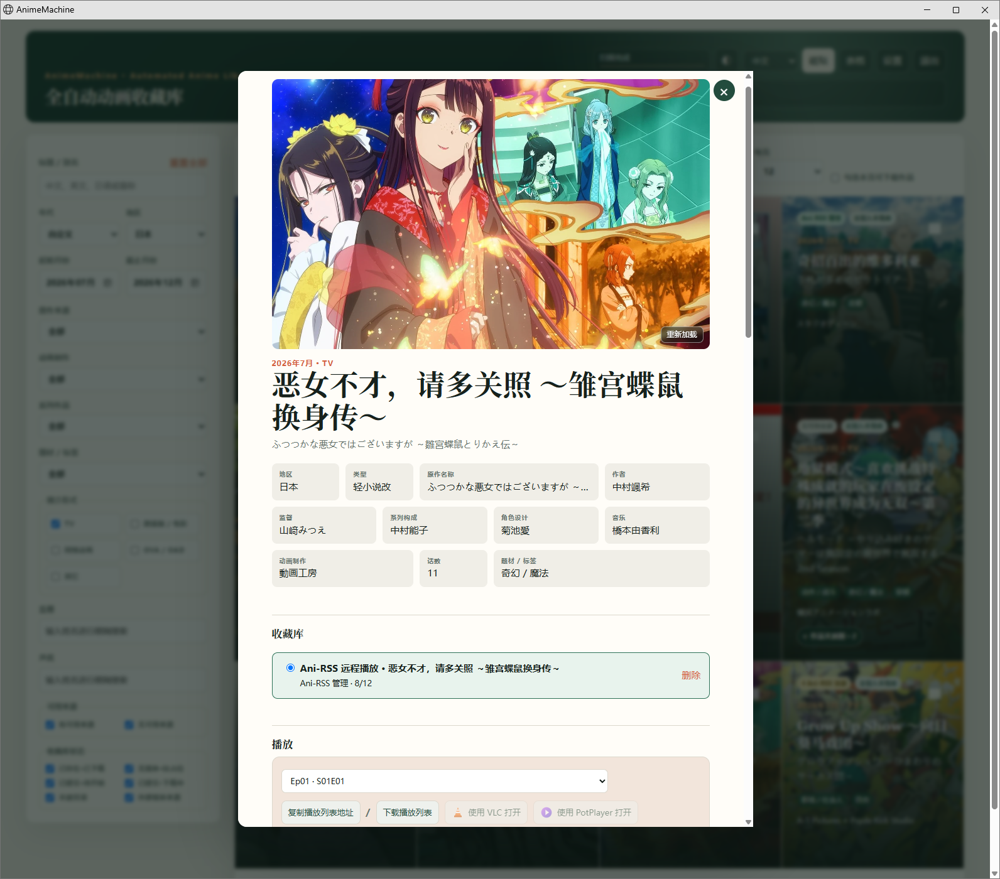
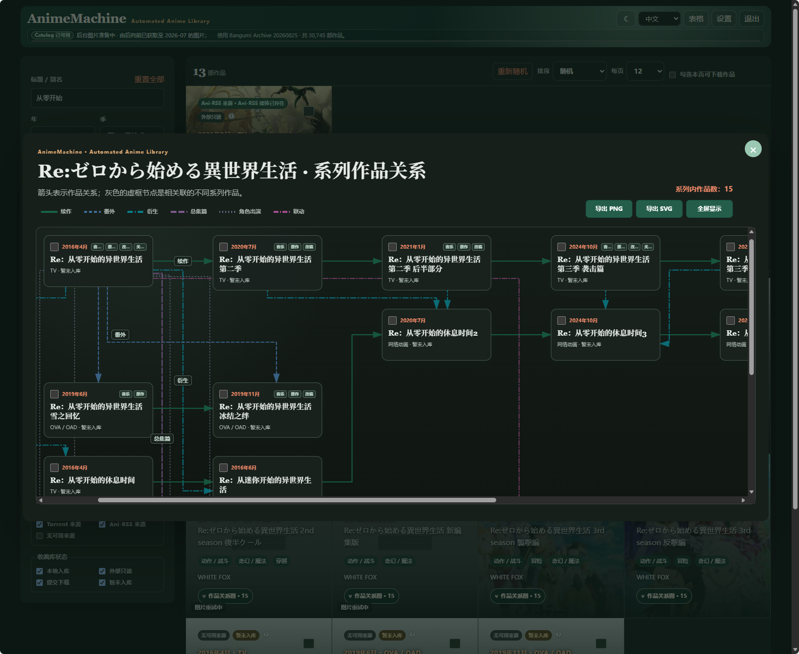
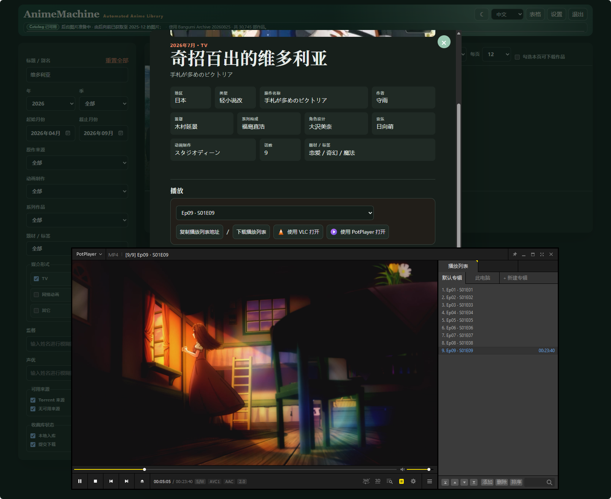
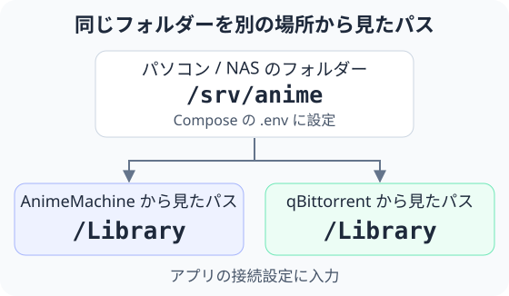

[中文](guide.md) | [English](guide.en.md) | [日本語](guide.ja.md)  
[README](../README.ja.md) · [アーキテクチャ](architecture.ja.md) · [設定リファレンス](reference.ja.md)

# 導入・利用ガイド

このガイドでは、導入、初期設定、日常の操作、保守手順を説明します。利用環境に合う起動方法を選び、ログイン後に必要なメディアフォルダーとサービス接続を設定します。

[起動方法](#start) · [初期設定](#first-use) · [日常の使い方](#daily-use) · [接続とフォルダー](#connections) · [更新とバックアップ](#maintenance) · [よくある質問](#help)

<a id="start"></a>

## 1. 起動方法を選ぶ

### Windows

1. [Releases](https://github.com/kyupi-git/animemachine/releases/latest) を開き、Assets から名前が `release-windows.zip` で終わるファイルをダウンロードします。
2. ZIP 全体を `D:\AnimeMachine` など、今後も使うフォルダーに展開します。
3. フォルダー内の **`AnimeMachine.cmd`** をダブルクリックし、起動ウィンドウを開いたままにします。
4. ブラウザーで **<http://localhost:8787>** を開きます。

Python は同梱されています。次回も同じファイルから起動してください。起動ウィンドウを閉じると終了します。

### Linux / macOS

[Python 3.11 以降](https://www.python.org/downloads/)をインストールし、[Releases](https://github.com/kyupi-git/animemachine/releases/latest) から OS とプロセッサーに合うパッケージをダウンロードします。`x86_64` は主に Intel / AMD、`arm64` または `aarch64` は ARM 向けです。Apple シリコンでは ARM 用を選びます。

Linux では展開したフォルダーでターミナルを開き、実行します。

```sh
./AnimeMachine-Linux.sh
```

macOS では **`AnimeMachine-macOS.command`** を開きます。展開したフォルダーのターミナルからも実行できます。

```sh
./AnimeMachine-macOS.command
```

ランチャーが必要なコンポーネントをインストールします。その後、**<http://localhost:8787>** を開いてください。ターミナルを閉じるか、`Ctrl+C` で終了します。実行権限のエラーが出た場合は、先に `chmod +x AnimeMachine*.sh AnimeMachine-macOS.command` を実行します。

<a id="docker"></a>

### NAS / Docker

NAS のアプリ管理で Docker / コンテナ管理を有効にするか、パソコンに [Docker](https://docs.docker.com/get-started/get-docker/) をインストールします。Docker Engine 24 以降、Docker Compose **2.20.3 以降**を使用してください。

現在の環境に合わせて構成を選びます。

| 利用環境 | 設定ファイル |
| --- | --- |
| 作品を探し、既存のメディアを接続する | [01 · AnimeMachine](https://github.com/kyupi-git/animemachine/blob/main/deploy/compose/01-animemachine-standalone/compose.yaml) |
| qBittorrent をすでに使っている | [02 · 既存のダウンローダーを接続](https://github.com/kyupi-git/animemachine/blob/main/deploy/compose/02-animemachine-external-qbt/compose.yaml) |
| qBittorrent も一緒に導入する | [03 · AnimeMachine + qBittorrent](https://github.com/kyupi-git/animemachine/blob/main/deploy/compose/03-animemachine-managed-qbt/compose.yaml) |
| ダウンローダー、Ani-RSS、リソース収集をまとめて導入する | [04 · フル構成](https://github.com/kyupi-git/animemachine/blob/main/deploy/compose/04-full-stack/compose.yaml) |

1. `animemachine` など、今後も使うフォルダーを作成します。
2. 表の設定ファイルを開き、**Download raw file** をクリックして、**`compose.yaml`** という名前で保存します。
3. そのフォルダーでターミナルを開き、下記を実行します。NAS の Compose プロジェクト画面では、設定を貼り付けて起動する方法も使えます。

```sh
docker compose up -d
```

4. **`http://NASのアドレス:8787`** を開きます。同じパソコンからなら **<http://localhost:8787>** を使います。
5. コンテナ管理画面で `animemachine` のログを開き、初回のアカウントとパスワードを確認します。ターミナルでは次を実行します。

```sh
docker compose logs animemachine
```

既定のフォルダーと接続は自動で作成されます。03 / 04 は qBittorrent、04 は Ani-RSS も設定済みです。02 を選んだ場合は、[接続の手順](#connections)に沿って既存のダウンローダーを設定してください。

保存先のディスクを指定する場合は、起動前に[フォルダー設定](#folders)に沿って `.env` を追加します。別のパソコンから qBittorrent や Ani-RSS を開く場合は、[管理画面へのアクセス](reference.ja.md#service-access)を設定します。

<a id="first-use"></a>

## 2. 初期設定

### ログインして作品一覧を確認する

起動ウィンドウやコンテナのログに、アクセス先、初回のユーザー名、自動生成されたパスワードが表示されます。ログイン後は、作品データのダウンロード、カタログ作成、カバー準備の進捗を確認してください。作品が表示されたら操作できます。カバーは引き続き追加されます。

他の利用者のアカウントは **設定 → ユーザー** から作成できます。新しい管理者アカウントを作成し、そのアカウントでログインしてから初期アカウントを無効にすることもできます。

### メディアフォルダーの設定と確認

**設定 → 接続** で、目的に合うフォルダーを設定します。

| 用途 | 設定項目 |
| --- | --- |
| 新しくダウンロードする作品を整理する | qBittorrent の「アニメライブラリのパス」 |
| 保存済みのアニメを見る | 「外部読み取り専用ライブラリを対応付ける」を有効にし、メディアフォルダーを入力 |
| Ani-RSS で取得したアニメを見る | Ani-RSS のメディアパスを入力。または API 経由のリモート再生を利用 |

Docker ではコンテナから見えるパスを入力します。既定のコレクションは `/Library`、既存メディアは `/External` です。[フォルダーの図](#folders)に具体例を載せています。

設定を保存して作品詳細を開き、識別されたメディアが再生できることを確認します。新作を購読する場合は、次の手順で購読を一つ追加し、同期結果を確認します。再生または購読の確認後、他の作品を追加します。



<a id="daily-use"></a>

## 3. 日常の使い方

### 作品を探す・絞り込む

ホーム画面はカードと表を切り替えられます。年代、月、形式、制作会社、テーマ、リソース元、所蔵状況で絞り込めます。中国語、繁体字中国語、英語、日本語の作品名でも検索できます。

カードにはリソースや購読の状態、メディアの所蔵状況が表示されます。詳細を開くと話数やファイルを確認できます。「新作追従」で更新を確認し、「ランダム」で見る作品を選べます。

### 新作レーダーと購読

先に [Ani-RSS を接続](#ani-rss)し、次の順に操作します。

1. **新作レーダー**を開き、前シーズン、今シーズン、次シーズンを選びます。各シーズンの作品は一ページに表示されます。
2. **同期**で購読、メディア、選択中のシーズンのリリース状態を更新します。**検索**は今シーズンの作品を順に検索し、進捗をすぐに表示します。一部の作品で失敗しても検索は続き、再度クリックすると未完了の作品を再検索できます。
3. 追いたい作品の **購読**をクリックし、リリースやグループを選んで確定します。
4. Ani-RSS がダウンロードを行います。登録中は画面を閉じて閲覧を続けられ、購読とメディアの状態が自動で反映されます。ダウンロード設定の対象外となるリリースには理由を表示します。

「最新 / 総話数」の最新話数には、Ani-RSS のリソースや購読記録を優先して使います。新話の更新日時は記録がある場合に表示します。「放送開始日」などの列見出しをクリックすると、シーズン全体を並べ替えられます。もう一度クリックすると逆順になります。

新しく購読した作品は、ホームの「新作追従」と「ランダム」で先頭に表示されます。年代、月などの絞り込み条件も適用されます。

### コレクションを補う・ダウンロードする

手元の `.torrent` ファイルは **Torrent プール**に入れます。フル Compose 構成では、リソース収集サービスがこのフォルダーにファイルを追加します。詳細な設定は[収集サービスの設定例](https://github.com/kyupi-git/animemachine/blob/main/deploy/compose/torrent-collector.advanced.env.example)を参照してください。

1. 作品を検索し、詳細で候補リリースと既存のファイルを確認します。
2. 収集したい作品を選んで計画を作り、取得するファイルと保存先を確認します。
3. 確定すると、qBittorrent に**停止状態**でタスクが追加されます。
4. qBittorrent でタスクを選んで開始します。完了後、AnimeMachine が所蔵状況を更新します。

計画では既存ファイルと比較し、不足分を選びます。リソースの好みは **設定 → リソース優先順位 / リリースグループ**で調整できます。

単話・単巻タスクの完了後は、**設定 → 購読**で後続リリースを監視できます。新しい候補が見つかると、確認待ちの項目として表示されます。

### 購読作品のフォルダー作成とライブラリの確認

書き込み可能なライブラリを接続して設定を保存すると、新作レーダーの **フォルダー**から、購読作品の空フォルダーを作成できます。既存のフォルダーを引き継ぎ、繰り返し実行しても作成済みのフォルダーは重複しません。

**設定 → 一般 → ライブラリ**にも同じ操作と **ローカルリソースをすべて確認**があります。処理はバックグラウンドで進み、進捗と結果を表示します。完全性は現在のファイルをもとに評価します。

### 作品関係図

カードや作品詳細の **作品関係図**を開くと、前作、続編、劇場版、番外編などを確認できます。ドラッグ、拡大・縮小、全画面表示、関係の絞り込み、画像の書き出しが使えます。



### 再生と字幕

作品詳細で再生元と開始する話を選び、VLC、PotPlayer、システムプレイヤーを開きます。macOS では IINA も使えます。**プレイリストをコピー**すると、シーズン全体を別のプレイヤーで開けます。



プレイヤーは視聴する機器にインストールしてください。別の機器で再生する場合は、**設定 → 接続 → 外部プレーヤー連携**に、その機器から開ける AnimeMachine のアドレスを設定します。例は `http://nas.example:8787` です。共有メディアへ直接アクセスできる場合は、SMB / NFS のパスマッピングも使えます。

動画内蔵の字幕、同じフォルダーにある外部字幕を使うほか、作品詳細から字幕ファイルや圧縮ファイルを取り込めます。オンライン検索を使う場合は、**設定 → 接続 → 字幕ソース**に ASSRT または OpenSubtitles のキーを設定し、検索結果から字幕を選びます。

<a id="connections"></a>

## 4. 接続とフォルダー

<a id="ani-rss"></a>

### 既存の Ani-RSS を接続する

Ani-RSS の **設定 → セキュリティ**で API Key を確認し、AnimeMachine の **設定 → 接続 → Ani-RSS** にコピーします。

| 項目 | 入力内容 |
| --- | --- |
| サービスアドレス | AnimeMachine から接続できる Ani-RSS のアドレス。ローカル導入なら `http://localhost:7789` など |
| API Key | Ani-RSS からコピーしたキー |
| モード | 通常は「Ani-RSS を優先」 |
| メディアパス | AnimeMachine から読める Ani-RSS の保存先。リモート API のみ使う場合は空欄 |

保存して **接続テスト**をクリックします。接続後はリソース、購読、メディアの状態が自動で同期されます。フル Compose 構成では接続済みです。

Ani-RSS とそのダウンローダーには、同じメディア保存先を設定します。細かな項目は Ani-RSS の[ダウンロード設定](https://docs.wushuo.top/config/download)と[購読の説明](https://docs.wushuo.top/add-rss)を参照してください。

### 既存の qBittorrent を接続する

**qBittorrent 5.2.0 以降**を使用します。qBittorrent の Web UI 設定で Web UI を有効にし、API Key を作成またはコピーします。

**設定 → 接続 → qBittorrent** にサービスアドレス、API Key、アニメライブラリのパス、qBittorrent から見えるライブラリのパスを入力します。保存して **接続テスト**をクリックしてください。Docker からホスト側のダウンローダーへ接続する場合は通常 `http://host.docker.internal:8080`、同じ Compose 内なら `http://qbittorrent:8080` を使います。

<a id="folders"></a>

### フォルダーとパスマッピング

同じフォルダーでも、NAS、AnimeMachine、ダウンローダーから見たパスは異なる場合があります。**Compose にはホスト側のパス、アプリの設定にはコンテナ内のパスを入力します。**



Compose の既定値は次のとおりです。ホスト側の相対パスは、`compose.yaml` のあるフォルダーを基準にします。

| ホスト側のフォルダー | AnimeMachine 内のパス | 用途 |
| --- | --- | --- |
| `./library` | `/Library` | 新規ダウンロードと整理したコレクション |
| `./torrents` | `/Torrents` | `.torrent` ファイル |
| `./external/read-only` | `/External` | 既存メディアを読み取り専用で参照・再生 |
| `./external/ani-rss` | `/Media` | Ani-RSS が取得したメディア |
| `./config`、`./data` | `/Config`、`/Data` | 設定、アカウント、実行記録 |

例えば `/srv/anime` に保存する場合は、`compose.yaml` と同じ場所に `.env` を作り、次を記入します。

```dotenv
ANM_LIBRARY_DIR=/srv/anime
```

`docker compose up -d` を実行します。AnimeMachine のライブラリ設定は `/Library` のままです。外部メディアやデータの保存先も同じ方法で変更できます。[設定変数](reference.ja.md#environment)を参照してください。

Windows で直接動かす場合は `D:\Anime` や `\\nas\Anime` などを指定します。Linux / macOS では NAS 共有をマウントし、そのパスを指定します。設定と実行データはアプリを動かす機器のローカルディスクに置き、メディアは NAS に保存できます。既存のフォルダー構成を使う場合は、外部読み取り専用ライブラリとして接続します。

<a id="maintenance"></a>

## 5. 設定・更新・バックアップ

言語、テーマ、表示形式、絞り込みは好みに合わせて変更できます。管理者は設定画面でフォルダー、接続、リソース規則、ユーザーを管理し、一般ユーザーは作品の閲覧や再生を行います。

Bangumi Archive の更新は毎週自動で確認します。**設定 → 一般 → カタログベースを確認・更新**からすぐに確認することもできます。ダウンロード済みの Archive ZIP は **ダウンロード済みベースを取り込む**で取り込めます。プロキシや独自証明書は[ネットワーク設定](reference.ja.md#ANM_CA_BUNDLE)を参照してください。

アプリの更新は **設定 → 更新を確認**から行います。説明を読んでから更新を確定します。既定では毎日確認し、新しいバージョンを通知します。確認時刻や自動インストールもここで変更できます。

Docker のイメージ全体を更新する場合は、元の Compose フォルダーで次を実行します。バージョン固定の構成では、先にイメージのタグを更新先のバージョンへ変更してください。

```sh
docker compose pull
docker compose up -d
```

バックアップは AnimeMachine を停止してから、次をコピーします。

| 導入方法 | 保存するもの |
| --- | --- |
| Windows / Linux / macOS のリリース | `config.json`、`.env.local`、`data` フォルダー全体 |
| Docker | Compose ファイル、`.env`（使用時）、`config` と `data` 全体。収集サービス用の独自フォルダーや名前付きボリュームも保存 |
| 共通 | メディアと Torrent プールを別途バックアップ |

復元時は対応する場所に戻し、同じ設定で起動します。別の機器へ移した場合は、その機器のパスに合わせてメディア設定を変更してください。移動、改名、バージョン置換の記録は **設定 → 履歴**から確認・復元できます。

<a id="help"></a>

## 6. よくある質問

| 状況 | 対処方法 |
| --- | --- |
| 初期パスワードを忘れた | ローカル導入または Docker のホスト側で `data/state/auth/initial-admin.txt` を確認するか、コンテナのログを開きます。初回に生成したアカウントの記録です。 |
| 作品一覧が空 | 初期化の進捗を確認し、データの取り込みを待ちます。「診断」でネットワークとアーカイブの状態を確認します。 |
| カバーが表示されない | カバーは順次追加されます。作品を探しながら、「診断」で進捗を確認できます。 |
| 保存済みのアニメが見つからない | AnimeMachine を動かす機器からフォルダーを読めるか確認します。Docker ではマウントと `/External` などのパスを確認します。 |
| 話数や購読が更新されない | Ani-RSS の接続をテストし、新作レーダーの **同期** をクリックして、Ani-RSS 側の購読も確認します。 |
| qBittorrent のタスクが始まらない | 計画が送信済みか確認し、qBittorrent で停止中のタスクを開始します。 |
| プレイヤーが開かない | プレイヤーをインストールし、ブラウザーで外部アプリの起動を許可します。プレイリストをコピーして開くこともできます。 |
| スマートフォンや別のパソコンで再生できない | 「外部プレイヤー連携」に視聴機器から開けるアドレスを設定し、AnimeMachine の画面が開くか確認します。 |
| ポートが使用中 | [ポート設定](reference.ja.md#ports)で別の番号に変更し、再起動します。 |

詳しく調べる場合は **設定 → 診断 / ログ**を開き、該当コンポーネントの状態と最近のエラーを確認します。ネットワークが復旧すると、バックグラウンドの再試行が続きます。
