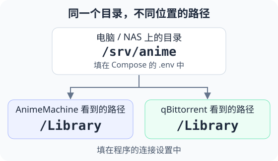

[中文](guide.md) | [English](guide.en.md) | [日本語](guide.ja.md)  
[README](../README.md) · [架构说明](architecture.md) · [配置参考](reference.md)

# 部署与使用指南

本指南介绍 AnimeMachine 的部署、首次设置、日常使用及维护方法。按设备选择启动方式，登录后配置所需的媒体目录与服务连接。

[选择启动方式](#start) · [首次使用](#first-use) · [日常使用](#daily-use) · [连接与目录](#connections) · [更新与备份](#maintenance) · [常见问题](#help)

<a id="start"></a>

## 1. 选择启动方式

### Windows

1. 打开 [Releases](https://github.com/kyupi-git/animemachine/releases/latest)，在 Assets 中下载名称带 `release-windows.zip` 的文件。
2. 将 ZIP 完整解压到一个固定目录，例如 `D:\AnimeMachine`。
3. 双击解压目录中的 **`AnimeMachine.cmd`**，保留启动窗口。
4. 在浏览器打开 **<http://localhost:8787>**。

发布包包含 Python 运行环境。后续仍通过同一个文件启动；关闭启动窗口即可停止程序。

### Linux / macOS

先安装 [Python 3.11 或更新版本](https://www.python.org/downloads/)，再从 [Releases](https://github.com/kyupi-git/animemachine/releases/latest) 下载与系统和处理器对应的包。`x86_64` 通常对应 Intel / AMD，`arm64` 或 `aarch64` 对应 ARM；Apple 芯片选择 ARM 包。

解压后，Linux 在解压目录打开终端，运行：

```sh
./AnimeMachine-Linux.sh
```

macOS 打开 **`AnimeMachine-macOS.command`**。也可以在解压目录的终端运行：

```sh
./AnimeMachine-macOS.command
```

启动器会安装所需组件。随后打开 **<http://localhost:8787>**。关闭终端或按 `Ctrl+C` 停止程序。遇到执行权限提示时，先运行 `chmod +x AnimeMachine*.sh AnimeMachine-macOS.command`。

<a id="docker"></a>

### NAS / Docker

先在 NAS 的应用中心启用 Docker / 容器管理，或在电脑上安装 [Docker](https://docs.docker.com/get-started/get-docker/)。使用 Docker Engine 24+、Docker Compose **2.20.3+**。

根据现有服务选择配置：

| 适用场景 | 配置文件 |
| --- | --- |
| 先浏览作品，接入已有媒体 | [01 · AnimeMachine](https://github.com/kyupi-git/animemachine/blob/main/deploy/compose/01-animemachine-standalone/compose.yaml) |
| 已经有 qBittorrent | [02 · 接入现有下载器](https://github.com/kyupi-git/animemachine/blob/main/deploy/compose/02-animemachine-external-qbt/compose.yaml) |
| 同时部署 qBittorrent | [03 · AnimeMachine + qBittorrent](https://github.com/kyupi-git/animemachine/blob/main/deploy/compose/03-animemachine-managed-qbt/compose.yaml) |
| 同时部署下载器、Ani-RSS 和资源采集器 | [04 · 完整组合](https://github.com/kyupi-git/animemachine/blob/main/deploy/compose/04-full-stack/compose.yaml) |

1. 新建一个固定目录，例如 `animemachine`。
2. 打开上表中的配置文件，点击 **Download raw file**，保存到该目录，文件名保留为 **`compose.yaml`**。
3. 在这个目录打开终端，执行下面的命令。在飞牛、群晖等 NAS 的 Compose 项目页面，也可以直接粘贴配置内容并启动。

```sh
docker compose up -d
```

4. 打开 **`http://NAS地址:8787`**。在本机部署则打开 **<http://localhost:8787>**。
5. 在容器管理页面查看 `animemachine` 的日志，获取首次登录账户和密码。使用终端时运行：

```sh
docker compose logs animemachine
```

默认目录和服务连接会自动建立。03 / 04 自动配置 qBittorrent，04 同时完成 Ani-RSS 连接；选择 02 时，按[连接说明](#connections)填写已有下载器的信息。

需要把媒体保存到指定磁盘时，在启动前按[目录设置](#folders)增加 `.env`。需要从其他电脑打开 qBittorrent 或 Ani-RSS 时，按[管理页面访问](reference.md#service-access)设置其访问地址。

<a id="first-use"></a>

## 2. 首次使用

### 登录并确认作品列表

启动窗口或容器日志会显示访问地址、初始用户名和随机密码。登录后，先看页面上的初始化进度：下载作品资料、建立作品库、准备封面。作品列表出现后即可操作，封面会继续补齐。

在 **设置 → 用户** 中可为其他使用者创建账户。也可以创建新的管理员账户，使用新账户登录后停用初始账户。

### 设置媒体目录并验证

在 **设置 → 连接** 中，按用途填写目录：

| 用途 | 设置项 |
| --- | --- |
| 整理新下载的收藏 | qBittorrent 下的“动画收藏库路径” |
| 浏览硬盘上已有的动画 | 启用“映射外部只读媒体库”，填写该媒体目录 |
| 接入 Ani-RSS 下载的动画 | Ani-RSS 下的“媒体路径”；也可直接使用其远程播放能力 |

Docker 中填写程序看到的容器路径；例如默认收藏库是 `/Library`，已有媒体是 `/External`。[目录示意图](#folders)给出了完整例子。

保存配置后，搜索一部作品并打开详情，确认已识别的媒体文件可以播放。如需追番，按下一节添加一部订阅并检查同步结果。完成一次播放或订阅验证后，再添加其他作品。


<a id="daily-use"></a>

## 3. 日常使用

### 浏览与筛选

首页可以切换卡片或表格，按年代、月份、类型、制作公司、主题、资源来源和收藏状态筛选。中文、繁体中文、英文、日文名称都可以用来搜索。

作品卡片上的 **资源可用 / 已订阅** 表示资源或追番状态，**暂未入库 / 部分入库 / 全部入库 / 外部只读** 表示媒体收藏状态。打开详情可查看具体集数和文件；“新作追更”用于查看更新，“随机”用于浏览作品。

### 新作雷达与追番

先[连接 Ani-RSS](#ani-rss)，再按下面的顺序操作：

1. 打开 **新作雷达**，选择上季度、本季度或下季度。
2. 点击标题右侧的 **检索本季度资源**，依次检查当前所选季度的作品。进度会显示已检查数量；个别作品失败后，其他作品会继续检索。
3. 找到想追的作品，点击 **订阅**，选择资源或字幕组，再确认订阅。
4. 下载由 Ani-RSS 执行。订阅状态和媒体话数会自动同步回 AnimeMachine。

“最新 / 总集数”的最新话数优先使用 Ani-RSS 的资源和订阅记录；“新集更新时间”在有记录时显示。点击“开播时间”等表头，可对整个季度重新排序，再点一次反向排列。

新订阅的作品会排到首页“新作追更”和“随机”的前方；首页的年代、月份等筛选仍然生效。

### 补齐收藏与下载

已有 `.torrent` 文件放入 **Torrent 池**目录。使用完整 Compose 组合时，资源采集器会在后台补充这个目录；采集参数见[配置示例](https://github.com/kyupi-git/animemachine/blob/main/deploy/compose/torrent-collector.advanced.env.example)。

1. 搜索作品，在详情中查看候选资源和已有文件。
2. 勾选要收藏的作品，生成计划，检查将下载的文件和目标目录。
3. 确认后，计划交给 qBittorrent，任务以**停止状态**加入。
4. 打开 qBittorrent，选中任务并开始下载。下载完成后，AnimeMachine 会更新收藏状态。

计划会比较已有文件，选择需要补齐的内容。资源偏好可在 **设置 → 资源优先级 / 资源组** 中调整。

单集、单卷任务完成后，还可以在 **设置 → 订阅** 中查看后续发布监视；发现新资源后会产生待确认项。

### 作品关系图

在卡片或详情中点击 **作品关系图**，查看前作、续作、剧场版、番外等关系。可以拖动、缩放、全屏查看，筛选关系类型，或导出图片。


### 播放与字幕

打开作品详情，选择播放来源和起始集，再点击 VLC、PotPlayer 或系统播放器。macOS 还可以使用 IINA。**复制播放列表**可以把整季地址交给其他播放器。


播放器安装在正在观看的设备上。跨设备播放时，在 **设置 → 连接 → 外部播放器交接** 中填写该设备能访问的 AnimeMachine 地址，例如 `http://nas.example:8787`；能直接访问共享媒体目录时，也可以设置 SMB / NFS 路径映射。

字幕可以使用媒体内嵌字幕、同目录外挂字幕，或在详情中导入字幕文件与压缩包。需要在线查找时，在 **设置 → 连接 → 字幕源** 中填写 ASSRT 或 OpenSubtitles 的账户密钥，再搜索和选择匹配结果。

<a id="connections"></a>

## 4. 连接与目录

<a id="ani-rss"></a>

### 接入已有 Ani-RSS

在 Ani-RSS 的 **设置 → 安全** 中找到 API Key，复制到 AnimeMachine 的 **设置 → 连接 → Ani-RSS**：

| 项目 | 填写内容 |
| --- | --- |
| 服务地址 | AnimeMachine 能访问的 Ani-RSS 地址，例如本地部署的 `http://localhost:7789` |
| API Key | 从 Ani-RSS 复制的密钥 |
| 调用模式 | 一般选择“优先调用 Ani-RSS” |
| 媒体路径 | AnimeMachine 可读取的 Ani-RSS 下载目录；仅使用远程 API 时可留空 |

保存后点击 **测试连接**。连接成功后，资源、订阅和媒体状态会自动同步。完整 Compose 组合已完成这些连接。

Ani-RSS 与它使用的下载器应看到相同的媒体保存路径。其下载设置和订阅选项可查看 [Ani-RSS 下载说明](https://docs.wushuo.top/config/download)与[订阅说明](https://docs.wushuo.top/add-rss)。

### 接入已有 qBittorrent

使用 **qBittorrent 5.2.0 或更新版本**。在 qBittorrent 的 Web UI 设置中启用 Web UI，并创建或复制 API Key。

在 **设置 → 连接 → qBittorrent** 中填写服务地址、API Key、动画收藏库路径和 qBittorrent 看到的收藏库路径，保存并点击 **测试连接**。Docker 连接宿主机上的下载器时，地址通常使用 `http://host.docker.internal:8080`；连接同一 Compose 中的下载器则使用 `http://qbittorrent:8080`。

<a id="folders"></a>

### 目录与路径映射

同一个媒体目录在 NAS、AnimeMachine 容器和下载器中可能使用不同的路径。**Compose 配置使用宿主机目录，程序设置使用容器内路径。**



默认 Compose 目录如下，左侧相对路径以 `compose.yaml` 所在目录为起点：

| 宿主机目录 | AnimeMachine 内的路径 | 用途 |
| --- | --- | --- |
| `./library` | `/Library` | 新下载和整理的收藏 |
| `./torrents` | `/Torrents` | `.torrent` 文件 |
| `./external/read-only` | `/External` | 已有媒体库，按只读方式浏览与播放 |
| `./external/ani-rss` | `/Media` | Ani-RSS 下载的媒体 |
| `./config`、`./data` | `/Config`、`/Data` | 设置、账户和运行记录 |

例如把收藏保存到 `/srv/anime`，在 `compose.yaml` 同目录新建 `.env`，写入：

```dotenv
ANM_LIBRARY_DIR=/srv/anime
```

然后执行 `docker compose up -d`。AnimeMachine 设置中的收藏库路径仍然是 `/Library`。外部库、数据目录等可用同样方式调整，变量见[配置参考](reference.md#environment)。

直接运行 Windows 时，可填 `D:\Anime` 或 `\\nas\Anime`；Linux / macOS 先挂载 NAS 共享，再填挂载目录。将设置和运行数据放在运行程序的本地磁盘上，媒体可以放在 NAS。现有媒体库选择“外部只读媒体库”，就可以沿用原目录结构。

<a id="maintenance"></a>

## 5. 设置、更新与备份

语言、主题、布局和浏览筛选可以按自己的习惯调整。管理员在设置中管理目录、连接、资源规则和用户；普通账户用于浏览与播放。

作品资料会每周自动检查 Bangumi Archive 更新，也可以在 **设置 → 常规 → 检查并更新底库** 中立即检查。已下载的 Archive ZIP 可以通过 **导入已下载的底包**使用。代理和自定义证书见[网络设置](reference.md#ANM_CA_BUNDLE)。

在 **设置 → 检查更新** 中检查新版本，阅读发行说明并确认更新。定期检查可在相应设置中启用。

Docker 更新完整镜像时，在原 Compose 目录运行；使用固定版本的配置先把镜像版本改为准备升级的版本：

```sh
docker compose pull
docker compose up -d
```

备份时，先停止 AnimeMachine，再复制下列内容：

| 部署方式 | 备份内容 |
| --- | --- |
| Windows / Linux / macOS 发布包 | `config.json`、`.env.local` 和整个 `data` 目录 |
| Docker | Compose 文件、`.env`（如有）、整个 `config` 和 `data` 目录；自定义的采集器数据目录或命名卷也一并备份 |
| 两种方式都适用 | 另行保存媒体和 Torrent 池 |

恢复时，把这些内容放回相应位置，再启动同一份配置。迁移设备后，按新设备的实际路径调整媒体目录。目录移动、改名和版本替换的记录，可在 **设置 → 历史记录** 中查看和恢复。

<a id="help"></a>

## 6. 常见问题

| 情况 | 处理方法 |
| --- | --- |
| 忘记初始密码 | 本地发布包查看 `data/state/auth/initial-admin.txt`；Docker 查看 `data/state/auth/initial-admin.txt` 或容器日志。该文件记录首次生成的账户。 |
| 作品列表暂时为空 | 查看初始化进度，等待作品资料导入；在“诊断”中查看网络和底包状态。 |
| 有作品但没有封面 | 封面在后台补齐，可继续浏览作品；进度可在“诊断”中查看。 |
| 没有识别到已有动画 | 确认媒体目录在运行 AnimeMachine 的设备上可读取；Docker 检查挂载，再检查 `/External` 等容器路径。 |
| 新作话数或订阅没有更新 | 测试 Ani-RSS 连接，点击“检索本季度资源”，并检查 Ani-RSS 中该订阅的更新情况。 |
| qBittorrent 中的任务没有开始 | 确认计划已提交，打开 qBittorrent 手动开始停止的任务。 |
| 播放器没有打开 | 安装对应播放器，允许浏览器打开外部应用；也可复制播放列表，在播放器中打开。 |
| 手机或另一台电脑无法播放 | 在“外部播放器交接”中填该设备可访问的地址，并测试它能打开 AnimeMachine 页面。 |
| 地址或端口被占用 | 按[端口设置](reference.md#ports)改用另一个端口，再重新启动。 |

进一步检查时，打开 **设置 → 诊断 / 日志**，查看对应组件的当前状态和最近错误。网络恢复后，后台任务会继续重试。
